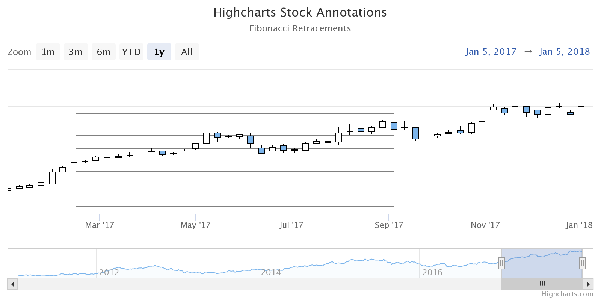
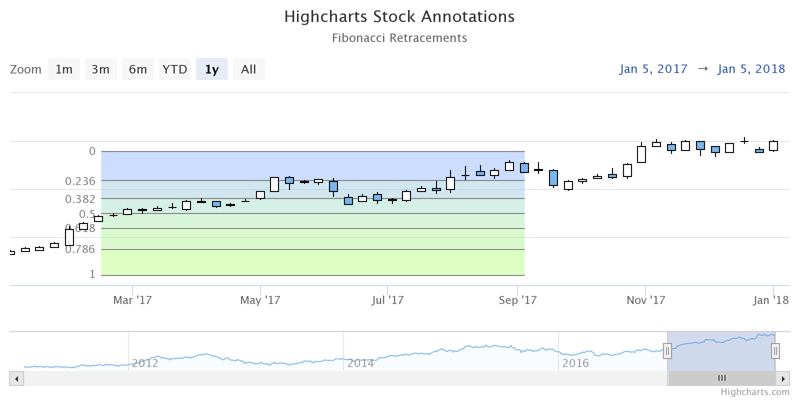

Annotations and fibonacci retracements
===

A Fibonacci retracement is a tool used in technical analysis which allows users to identify [reversal levels](https://www.investopedia.com/terms/f/fibonacciretracement.asp).

<iframe style="width: 100%; height: 450px; border: none;" src="https://www.highcharts.com/samples/embed/stock/annotations/fibonacci-retracements" allow="fullscreen"></iframe>

THE CONCEPT
-----------

Annotations can be built from simple blocks such as labels and shapes, and the concept of the Fibonacci retracements chart is to set up annotations by using points’ coordinates. Below is an example of the annotation structure:

    
      {
        labels: [ /* options for labels */ ],
        shapes: [ /* options for lines */, /* options for backgrounds */ ]
      }
    

The Fibonacci retracements function gets the points’ coordinates as arguments and returns an object that is the annotations’ configurations: `function fibonacciRetracements (x1: Number, y1: Number, x2: Number, y2: Number): Object`

How to set up the Fibonacci retracements
----------------------------------------

Let’s create the Fibonacci retracements chart with seven labels, seven horizontal lines, and six rectangular backgrounds between every two horizontal lines.

**Step 1. Calculate the retracements:**

    
       const levels = [0, 0.236, 0.382, 0.5, 0.618, 0.786, 1],
           diff = y2 - y1;

       const retracementlevel = y2 - diff * level;
    

**Step 2. Build the horizontal lines:**

    
        const lines = [];
    
        levels.forEach(function (level, i) {
            const retracement = y2 - diff * level,
                p1 = point(x1, retracement),
                p2 = point(x2, retracement);
    
            lines.push({
                type: 'path',
                points: [ p1, p2 ],
                stroke: 'grey'
            });
        });
    

 

**Step 3. Build the labels:**

    
        const labels = [];
    
        levels.forEach(function (level, i) {
            const retracement = y2 - diff * level,
                p1 = point(x1, retracement),
                p2 = point(x2, retracement);
    
            labels.push({
                point: p1,
                text: level.toString(),
                allowOverlap: true,
                align: 'right',
                y: 0,
                backgroundColor: 'none',
                verticalAlign: 'middle',
                shape: 'rect',
                borderWidth: 0,
                style: {
                    color: 'grey'
                }
            });
        });
    

 

**Step 4. Set up the backgrounds:**

    
        const backgrounds = [];
        const colors = [
            'rgba(130, 170, 255, 0.4)',
            'rgba(139, 191, 216, 0.4)',
            'rgba(150, 216, 192, 0.4)',
            'rgba(156, 229, 161, 0.4)',
            'rgba(162, 241, 130, 0.4)',
            'rgba(169, 255, 101, 0.4)'
        ];
    
        levels.forEach(function (level, i) {
            const retracement = y2 - diff * level,
                p1 = point(x1, retracement),
                p2 = point(x2, retracement);
    
            if (i > 0) {
                backgrounds.push({
                    type: 'path',
                    points: [ lines[i - 1].points[0], lines[i - 1].points[1], lines[i].points[1], lines[i].points[0] ],
                    strokeWidth: 0,
                    fill: colors[i - 1]
                });
            }
        });
    

 

**Step 5. Gather the pieces together:**

    
        returns {
            labels: labels,
            shapes: lines.concat(backgrounds),
            zIndex: 2
        };
    

Check the live demo [here](https://jsfiddle.net/gh/get/library/pure/highcharts/highcharts/tree/master/samples/stock/annotations/fibonacci-retracements).
