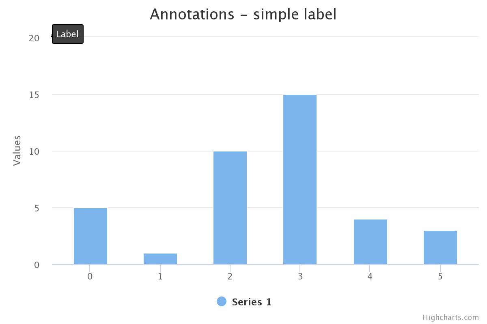

Annotations module
===

The annotations module allows users to annotate a chart freely with labels and shapes. Without the annotations module, the only way to render shapes or labels in any place on a chart was to use the [Renderer API](https://api.highcharts.com/highcharts/Renderer). The Annotations creates a declarative API for adding shapes and labels to a chart. 

Include the file `modules/annotations.js` after `highcharts.js` or `highstock.js` to enable annotations.

<iframe style="width: 100%; height: 432px; border: none;" src="https://www.highcharts.com/samples/embed/highcharts/demo/annotations" allow="fullscreen"></iframe>

Click [here](https://jsfiddle.net/gh/get/library/pure/highcharts/highcharts/tree/master/samples/highcharts/demo/annotations/) to check the code.

The concept
-----------

A single annotation is composed of simple blocks such as labels and shapes. An annotation contains only a simple label pointing to a top left corner of the chart ((0, 0) point in the chart pixel coordinates). Check the example below:

```js
annotations: [{
    labels: [{
        point: { x: 0, y: 0 },
        text: 'Label'
    }]
}]
```


The options may look overcomplicated but that structure allows to define complex annotations and serves as the basis for further extensions.

The point option
----------------

In our first annotation, the label was attached to the chart’s pixel coordinates. That means that label will stay at the same place even if the chart is zoomed or panned. The index or the `id` of the axis needs to be specified to attach the label to a point in the chart’s axes coordinates. Check the demo below:

```js
annotations: [{
    labels: [{
        point: {
            x: 3,
            y: 129.2,
            xAxis: 0,
            yAxis: 0
        }
    }, {
        point: {
            x: 0,
            y: 0
        }
    }, {
        point: {
            x: 5,
            y: 100,
            xAxis: 0
        }
    }]
}]
```

Both annotation configurations are represented on this chart (see below). Try to zoom in and out to see the differences:


<iframe style="width: 100%; height: 432px; border: none;" src="https://www.highcharts.com/samples/embed/highcharts/annotations/mock-point" allow="fullscreen"></iframe>

Click [here](https://jsfiddle.net/gh/get/library/pure/highcharts/highcharts/tree/master/samples/highcharts/annotations/mock-point/) to check the code.

The labels option
-----------------

The labels option defines annotations’ labels. The available options are very similar to the options presented by the data labels. For the full list see the [API](https://api.highcharts.com/highcharts/annotations.labels).

In case of many labels with the same options, use the `labelOptions` property to define common options. Each label options will be merged with the options from `labelOptions`.

Common options for all annotations in all charts in the page can otherwise be set using the `Highcharts.setOptions` function, which is especially suitable for theming.

The shapes option
-----------------

Similar to the labels option, the shapes option defines a shape object. This object requires the `type` property such as `circle`, `rect`, `ellipse`, or `path`.

The `ellipse` and `path` types require defining points property as an array of points, whereas `rect` and `circle` take only one point to render.

`xAxis` and `yAxis` can be used on point level, to convert `x` and `y` values to axis units, and on `shapes` or `shapeOptions` level, to convert points and size values like `width`, `height`, `ry` and `r`.

Read more about basic shapes annotations at [annotations shapeOptions API](https://api.highcharts.com/highcharts/annotations.shapeOptions).

Examples of shapes created with axis units
-----------------

Circle configuration:
```js
annotations: [{
    shapeOptions: {
        xAxis: 0,
        yAxis: 0
    },
    shapes: [{
        point: {
            x: 1,
            y: 50
        },
        type: 'circle',
        r: 50
    }]
}]
```

Rect configuration:
```js
annotations: [{
    shapeOptions: {
        xAxis: 0,
        yAxis: 0
    },
    shapes: [{
        point: {
            x: 3,
            y: 150
        },
        type: 'rect',
        width: 1,
        height: 100
    }]
}]
```
Ellipse configuration:
```js
annotations: [{
    shapeOptions: {
        xAxis: 0,
        yAxis: 0
    },
    shapes: [{
        points: [{
            x: 1,
            y: 150
        }, {
            x: 2.5,
            y: 150
        }],
        type: 'ellipse',
        ry: 50
    }]
}]
```
Path configuration:
```js
annotations: [{
    shapeOptions: {
        xAxis: 0,
        yAxis: 0
    },
    shapes: [{
        type: 'path',
        points: [{
            x: 0,
            y: 300
        }, {
            x: 4,
            y: 180
        }, {
            x: 6,
            y: 195,
        }]
    }]
}]
```

<iframe style="width: 100%; height: 432px; border: none;" src="https://www.highcharts.com/samples/embed/highcharts/annotations/shapes-axis-units" allow="fullscreen"></iframe>

Defining markers for the path
-----------------------------

It is possible to define markers at the end and at the beginning of the path. To apply the markers set `markerEnd` or `markerStart` property to the id of the marker. Check the following example about how to define custom markers [here](https://jsfiddle.net/gh/get/library/pure/highcharts/highcharts/tree/master/samples/highcharts/annotations/custom-markers).

## Build a custom UI

The annotations module allows for flexible and easy addition of labels and shapes to your charts. To create a custom user interface that enhances this functionality, providing seamless user interaction, refer to the [Annotations GUI](https://www.highcharts.com/docs/advanced-chart-features/annotations-gui) page for detailed instructions.
