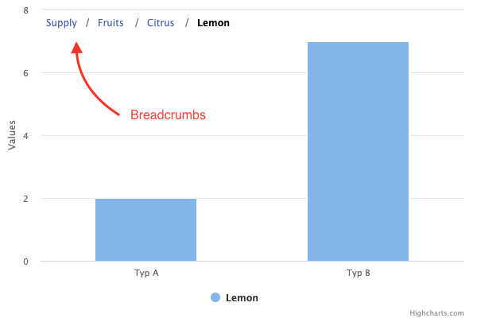

Breadcrumbs
============

Breadcrumbs are an aid for navigation data structures, used in the drilldown module and for hierarchy series types like treemap and sunburst. It allows the end user to find their way back to previous levels of drilldown or hierarchy. The Breadcrumbs module offers a separate API and can also be used for custom scenarios.

Depending on the `showFullPath` property, the breadcrumbs show the full path leading back to the top level, or only the lowest level. Before this feature was introduced in Highcharts v10, the drill-up and traverse-up buttons' behavior was equivalent to [setting `showFullPath` to `false`](https://jsfiddle.net/gh/get/library/pure/highcharts/highcharts/tree/master/samples/highcharts/breadcrumbs/single-button/).



## Breadcrumbs in drilldown

For use with the [drilldown feature](https://www.highcharts.com/docs/chart-concepts/drilldown), the `breadcrumbs` configuration object should be placed inside the `drilldown` object. [Demo](https://jsfiddle.net/gh/get/library/pure/highcharts/highcharts/tree/master/samples/highcharts/breadcrumbs/format).

``` JS
drilldown: {
    breadcrumbs: {
        floating: true,
        position: {
            align: 'right'
        }
    },
    ...
}
```

## Breadcrumbs in treemap/sunburst

Hierarchical series types like treemap and sunburst support traversing the tree by clicking points. For these series, the `breadcrumbs` config should be declared inside the series. They are enabled by default. [Demo](https://jsfiddle.net/gh/get/library/pure/highcharts/highcharts/tree/master/samples/highcharts/demo/sunburst)

``` JS
series: [{
    breadcrumbs: {
        showFullPath: false
    },
    type: 'treemap',
    ...
}]
```
## Breadcrumbs standalone

Breadcrumbs might also be used as a standalone element. To do so, a list of levels and their options need to be created. Then the `Breadcrumbs` class is instanciated. Chart and breadcrumbs options should be passed as arguments. To calculate the list use the `updateProperties` method, then breadcrumbs are ready to be rendered. [See jsFiddle for a live demo](https://jsfiddle.net/gh/get/library/pure/highcharts/highcharts/tree/master/samples/highcharts/breadcrumbs/standalone).


## API

For more information see the API reference for [drilldown breadcrumbs](https://api.highcharts.com/highcharts/drilldown.breadcrumbs) and [treemap breadcrumbs](https://api.highcharts.com/highcharts/plotOptions.treemap.breadcrumbs).