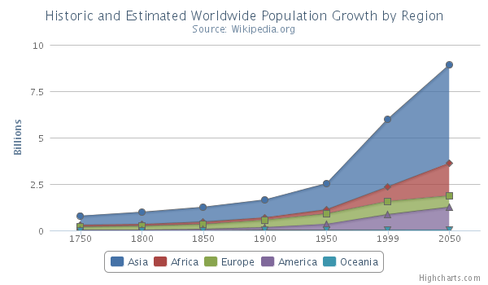
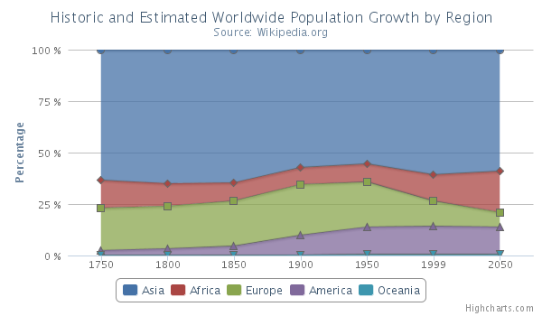

Stacking charts
===============

Column and area type series can be set to stack on top of each other instead of overlapping. There are two available options, "normal" stacking and "percentage" stacking. Normal stacking stacks the data series on top of each other in order. Percent stacking fills the plot area and draws each point of data with a relative percentage to all the points in the same category.

Here is an example of normal stacking:

Here is an example of percent stacking:

