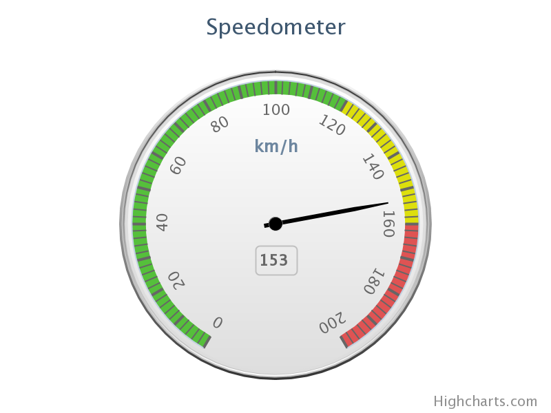

Angular gauges
==============

Angular gauges are also known as dials or speedometer-like widgets, and provide a great visualisation for dashboards. Like with polar charts, we extended the already existing series/points/axis model, and implemented the gauges as a new series type with one value axis, the yAxis. Which means that everything you learned about working dynamically and statically with other Highcharts series types, also applies to the angular gauges. 

One thing that is important to notice is that gauges have no x-axis. The x-axis in a gauge is completely stripped for functionality and operations on this axis, it will not be drawn on the chart.

To create an Angular gauge set chart.type to "gauge":

    
    chart: {
        type: 'gauge'            
    }

Normally there is only one point in a gauge series, but it also handles multiple point, like in our clock example with three dials. You can add as many background elements as you like to the gauge, allowing you to style it all the way from the minimal default design to heavy, 3D like works of art with shadows and reflections created with linear and radial gradients.

Solid gauges
------------

Since Highcharts 4, we also provide a second type of gauges, the `solidgauge`. It is similar to the gauge series, but has a solid color displaying the value, and responds to color setting on the Y axis, similar to the colorAxis of a map. Read more in the [API](https://api.highcharts.com/highcharts/plotOptions.solidgauge).

Gauge examples
--------------

*   [Spedometer with dual axes](https://jsfiddle.net/highcharts/EjRLw/)
*   [The Highcharts Clock](https://jsfiddle.net/highcharts/3CUgG/)
*   [VU meter](https://jsfiddle.net/highcharts/wCJjE/)