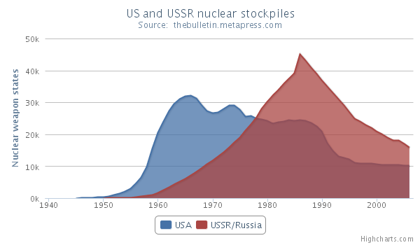

Area chart
==========

The area chart functions the same way as a line chart only it fills the area between the line and the [threshold](https://api.highcharts.com/highcharts/plotOptions.area.threshold), which is 0 by default.

For an overview of the area chart options see the [API reference](https://api.highcharts.com/highcharts/plotOptions.area).