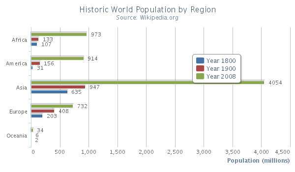
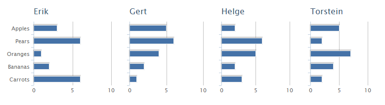

Bar chart
=========

The bar chart is exactly the same as a column chart only the x-axis and y-axis are switched.

The bar chart have the same options as a [series](https://highcharts.com/docs/chart-concepts/series). For an overview of the area chart options see the [API reference](https://api.highcharts.com/highcharts/plotOptions.bar)

Trellis chart
-------------

The bar chart can be used as a trellis chart by drawing several bar charts in a grid. Here is an example using a HTML table with four bar charts:

The example can be found at [https://jsfiddle.net/highcharts/VqruM/](https://jsfiddle.net/highcharts/VqruM/).