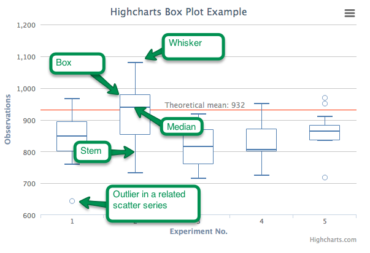

Box plot series
===

A box plot is a convenient way of depicting groups of data through their five-number summaries: the smallest observation (sample minimum), lower quartile (Q1), median (Q2), upper quartile (Q3), and largest observation (sample maximum). Combined with a scatter series, the box plot may also indicate which observations, if any, might be considered outliers.

### Data format

Each point in a box plot has five values: low, q1, median, q3 and high. Highcharts recognizes three ways of defining a point:

*   Object literal. The X value is optional.  
    `{ x: Date.UTC(2013, 1, 7), low: 0, q1: 1, median: 2, q3: 3, high: 4 }`
*   Array of 5 values. The X value is inferred.  
    `[0, 1, 2, 3, 4]`
*   Array of 6 values. The X value is the first position.  
    `[Date.UTC(2013, 1, 7), 0, 1, 2, 3, 4]`

### Styling the boxes

The different parts of the box anatomy can be styled individually. The stem, whiskers and median have their own options for line width, color and dash style, while the box itself is subject to the color, lineWidth and fillColor options. See [plotOptions.boxplot](https://api.highcharts.com/highcharts/plotOptions.boxplot) for a full reference, and [the box plot styling](https://jsfiddle.net/gh/get/jquery/1.7.2/highslide-software/highcharts.com/tree/master/samples/highcharts/plotoptions/box-plot-styling/) sample for a demonstration.