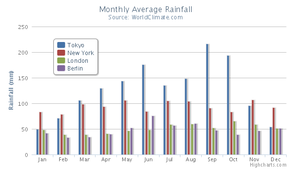

Column chart
============

A column chart displays data as vertical bars.

The column chart has the same options as a [series](https://highcharts.com/docs/chart-concepts/series). For an overview of the area chart options see the [API reference](https://api.highcharts.com/highcharts/plotOptions.column).

Histogram
---------

Column charts can be used to make histogram charts by setting the padding between points and groups to 0.

    
    plotOptions: {
        column: {
            pointPadding: 0,
            borderWidth: 0,
            groupPadding: 0,
            shadow: false
        }
    }
    

Note that borderWidth and shadows are also turned off in the example so the columns do not overlap.