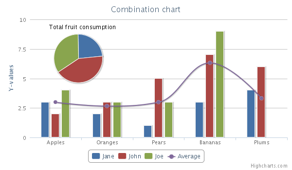

Combining chart types
=====================

To combine several chart types in one chart you only need to create series of different types:

    
    series: [{
    type: 'column',
    name: 'Jane',
    data: [3, 2, 1, 3, 4] },  {
    type: 'column',
    name: 'John',
    data: [2, 3, 5, 7, 6] },  {
    type: 'column',
    name: 'Joe',
    data: [4, 3, 3, 9, 0] },  {
    type: 'spline',
    name: 'Average',
    data: [3, 2.67, 3, 6.33, 3.33] }]

A live example can be found in the [Highcharts demo](https://www.highcharts.com/demo/combo).

