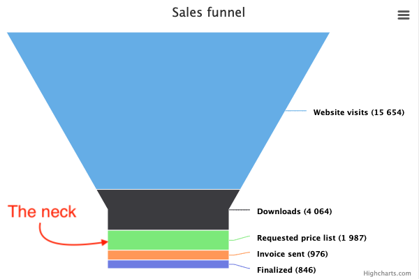

Funnel series
=============

[See live demo](https://highcharts.com/demo/funnel).

Funnel charts are a type of chart often used to visualize stages in a sales project, where the top are the initial stages with the most clients. The funnel narrows as more clients drop off. 

### Requirements

In order for funnel series to run, the `modules/funnel.js` file must be loaded after `highcharts.js`.

### Setting the funnel size

Each element of the funnel has a height that relates to the value. The size of the funnel by default fills the plot area, and can be overridden by width and height settings. In addition, the neck's size can be set by the [neckWidth](https://api.highcharts.com/highcharts/plotOptions.funnel.neckWidth) and [neckHeight](https://api.highcharts.com/highcharts/plotOptions.funnel.neckHeight) options. For the full set of options related to the funnel chart type, see [plotOptions.funnel](https://api.highcharts.com/highcharts/plotOptions.funnel) in the API reference.