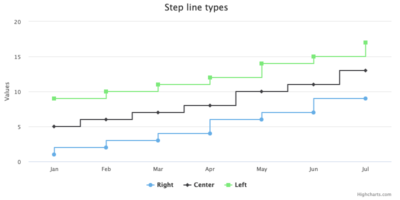

Line chart
==========

The line chart is represented by a series of datapoints connected with a straight line. Line charts are most often used to visualize data that changes over time.

<iframe style="width: 100%; height: 470px; border: none;" src="https://www.highcharts.com/samples/embed/highcharts/demo/line-chart" allow="fullscreen"></iframe>

Line chart features
===================

The line chart inherit the options a [series](https://highcharts.com/docs/chart-concepts/series) has plus some more. See the [API reference](https://api.highcharts.com/highcharts/plotOptions.line) for a full list of the line chart plotOptions.

Most options set in plotOptions can also be set on a individual series.

Step
----

Allows the use of steps instead of a straight line.

[Try it here](https://jsfiddle.net/gh/get/library/pure/highcharts/highcharts/tree/master/samples/highcharts/plotoptions/line-step/)

Code to enable step:

    
    plotOptions: {
        series: {
            step: 'left' // or 'center' or 'right'
        }
    }