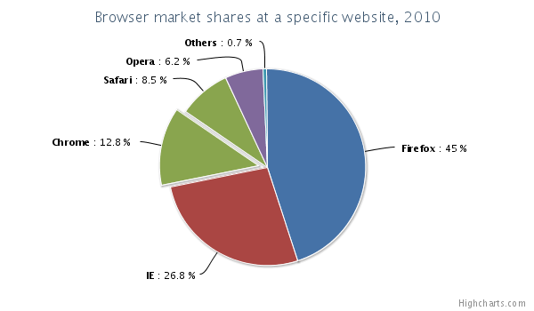

Pie chart
=========

A pie chart is a circular chart divided into sectors which is proportional to the quantity it represents.

The pie chart have the same options as a [series](https://highcharts.com/docs/chart-concepts/series). For an overview of the area chart options see the [API reference](https://api.highcharts.com/highcharts/plotOptions.pie).

Pie chart features
==================

Donut chart
-----------

A donut chart is created by adding multiple pie series to the chart, setting the size and innerSize of each series to create concentric rings. See the [demo page for donuts](https://highcharts.com/demo/pie-donut).

Radial gradient colors
----------------------

A 3D-like ball look is created by applying radial gradient background colors for the slices. See the [demo page for radial gradients](https://highcharts.com/demo/pie-gradient).