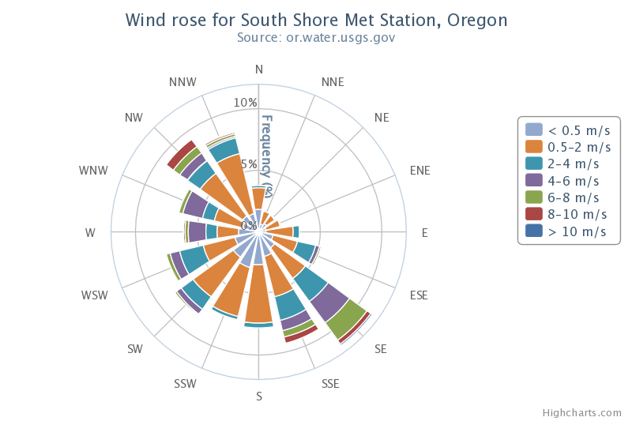

Polar (Radar) Chart
===================

Polar charts, also known as radar charts, require the highcharts-more.js file.

We took great care to reuse existing options and patterns when designing the option set of polar charts. The result is one single switch to turn a regular X-Y chart into a polar chart. Add the chart.polar option, and the X axis is wrapped around the perimeter while the Y axis extends from the center to the top.

To create a polar chart set chart.polar to be true:

    
    chart: {
        polar: true
    }

Every aspect of the chart anatomy, including series types like lines, areas, splines and columns as well as features like plot bands, data labels, tooltips, click events, stacking and axis setup, are transformed to the polar coordinate system.

Options related to polar charts
-------------------------------

|Option|Description|
|------|-----------|
|[chart.polar](https://api.highcharts.com/highcharts/chart.polar)|When true, cartesian charts are transformed into the polar coordinate system.|
|[pane](https://api.highcharts.com/highcharts#pane)|This configuration object holds general options for the combined X and Y axes set. Each xAxis or yAxis can reference the pane by index.|
|[pane.background](https://api.highcharts.com/highcharts/pane.background)|An object, or array of objects, for backgrounds. Sub options include backgroundColor (which can be solid or gradient),innerWidth, outerWidth, borderWidth, borderColor.|
|[pane.center](https://api.highcharts.com/highcharts/pane.center)|The center of the polar chart, given as an array of [x, y] positions. Positions can be given as integers that transform to pixels, or as percentages of the plot area size. Defaults to ['50%', '50%']|
|[pane.endAngle](https://api.highcharts.com/highcharts/pane.endAngle)|The end angle of the polar X axis, given in degrees where 0 is north. Defaults to startAngle + 360.|
|[pane.startAngle](https://api.highcharts.com/highcharts/pane.startAngle)|The start angle of the polar X axis, given in degrees where 0 is north. Defaults to 0.|
|[plotOptions.series.pointPlacement](https://api.highcharts.com/highcharts/plotOptions.series.pointPlacement)|This option applies to cartesian charts as well. In a column chart, when the pointPlacement is "on", the point will not create any padding of the X axis, and thus the first column will point directly north in a polar chart. If the pointPlacement is "between", the columns will be laid out between ticks. This is useful for example for visualising an amount between two points in time or in a certain sector of a polar chart.|

Polar chart examples
--------------------

*   [A polar chart with different series types](https://jsfiddle.net/highcharts/z9nyR/)
*   [A spider web](https://jsfiddle.net/highcharts/xEAxK/)
