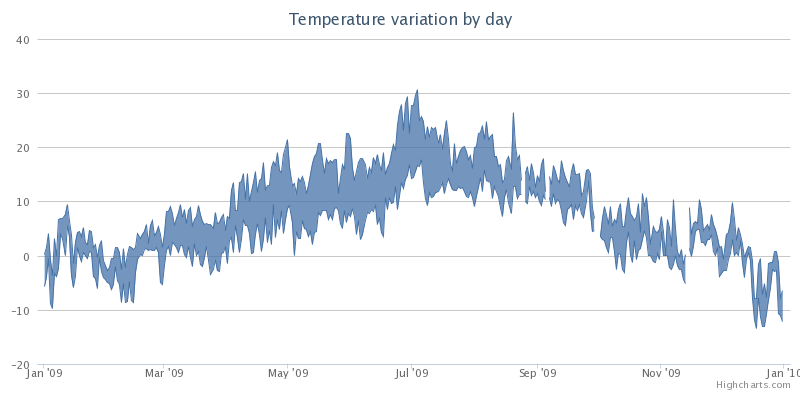

Range series
============

Using range series requires that the highcharts-more.js file is loaded.

Highcharts includes range series in three different flavours, namely "arearange", "areasplinerange" and "columnrange". Instead of cluttering up the API with a "barrange" series type, we let you achieve this by setting [chart.inverted](https://api.highcharts.com/highcharts/chart.inverted) to true with a column range series. Data points for range series can be defined either as objects ({ x: 0, low: 1, high: 9 }) or as arrays ([0, 1, 9]). In either case, the x value can be skipped.

To create a range series set chart.type or series.type to "columnrange":

    
    chart: {
        type: 'columnrange'
    }

Options related to Range series
-------------------------------

|Option|Description|
|------|-----------|
|[dataLabels](https://api.highcharts.com/highcharts/plotOptions.arearange.dataLabels)|Since both the low values and high values for a series need a separate data label, we added a new set of options, "xLow", "xHigh", "yLow" and "yHigh". With these options, the relative position can be altered.|

Range series examples
---------------------

*   [View horizontal column range example with data labels](https://jsfiddle.net/highcharts/XjzFH/)
