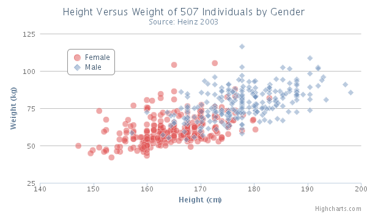

Scatter chart
=============

A scatter chart draws a single point for each point of data in a series without connecting them.

Scatter chart features
----------------------

An important distinction between a scatter series and a line series is that the scatter series doesn't require sorting because the mouse tracker for the tooltip is activated on each single marker. A line can be drawn between the markers by setting the lineWidth option to something higher than 0.

For an overview of the scatter chart options see the [API reference](https://api.highcharts.com/highcharts/plotOptions.scatter).

3D scatter charts
-----------------

In 3D charts, the scatter points also have a Z dimension. This is handled by a separate series type, [scatter3D](https://api.highcharts.com/highcharts/plotOptions.scatter3d).