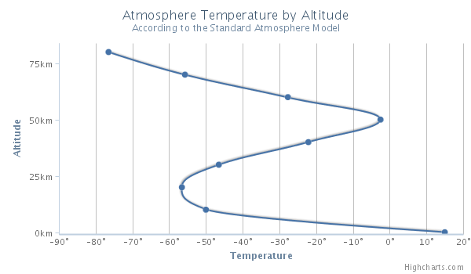

Spline chart
============

The spline chart draws a curved line between the points in a data series.

Spline chart features
---------------------

The spline chart offers the same options as the [line chart](docs/chart-and-series-types/line-chart) and [series](/docs/chart-concepts/series), except the step feature. See the [API reference](https://api.highcharts.com/highcharts/plotOptions.spline) for more information on the spline chart options.