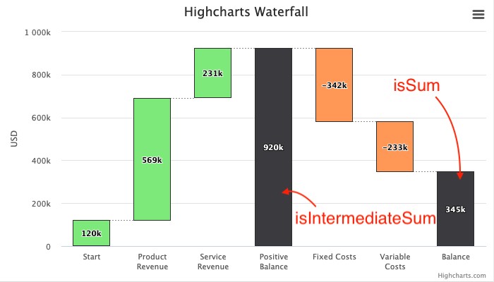

Waterfall series
================

A waterfall chart is a form of data visualization that helps in determining the
cumulative effect of sequentially introduced positive or negative values. The
waterfall chart is also known as also known as **bridge**, especially in
finance, or a flying bricks chart due to the apparent suspension of columns in
mid-air. Waterfall charts are commonly used in financial reports to display
changes in revenue or expenses over periods, showing how each factor contributes
to the overall result.

### Defining the points

Defining the points in a waterfall is pretty straight forward. Each point is accumulated on top of the next, or subtracted from the sum if it is negative. The most intuitive way of defining a series is to give each point a name and an Y value, and set [xAxis.type](https://api.highcharts.com/highcharts/xAxis.type) to _"category"_. A live demo can be seen at [www.highcharts.com/demo/waterfall](https://highcharts.com/demo/waterfall).

Furthermore, a waterfall series has two kinds of automatically computed columns. These points don't have an Y value, only a flag that specifies their type:

*   `isIntermediateSum`   
    When this property is true, the points acts as a summary column for the values added or subtracted since the last intermediate sum.
*   `isSum`  
    When this property is true, the point display the total sum across the entire series.

Sample code:

    
    data: [{
        name: 'Start',
        y: 120000
    }, {
        name: 'Product Revenue',
        y: 569000
    }, {
        name: 'Service Revenue',
        y: 231000
    }, {
        name: 'Positive Balance',
        isIntermediateSum: true,
        color: '#0066FF'
    }, {
        name: 'Fixed Costs',
        y: -342000
    }, {
        name: 'Variable Costs',
        y: -233000
    }, {
        name: 'Balance',
        isSum: true,
        color: '#0066FF'
    }]

### Colors

The up and down points can be colored separately through the [color](https://api.highcharts.com/highcharts/plotOptions.waterfall.color) and [upColor](https://api.highcharts.com/highcharts/plotOptions.waterfall.upColor) properties. Sums and intermediate sums have no specific colors, but these columns - as any column - can be colored by individual color settings.