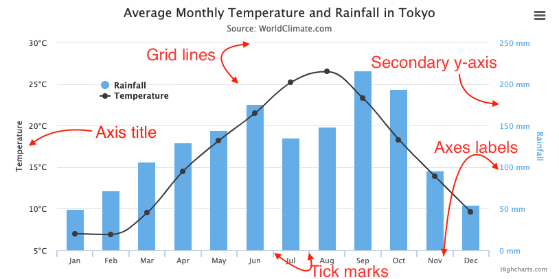
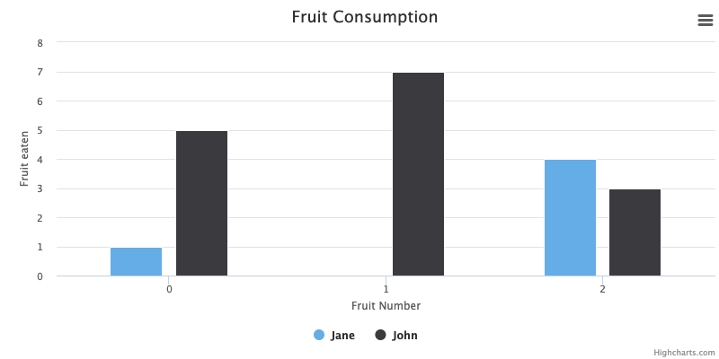

Axes
====

The x-axis and y-axis are shown by default in all charts containing data series with a [cartesian coordinate system](https://en.wikipedia.org/wiki/Cartesian_coordinate_system). Here is a quick overview of the axis elements:

Axis labels, tickmarks and gridlines
------------------------------------

The axis labels, tickmarks and gridlines are closely linked and all scale together. Their positioning is calculated to best fit the data present in a chart. 

### Ticks

Tick marks are the lines placed along an axis to show the units of measurement. The spacing between ticks are mainly decided by the [tickInterval](https://api.highcharts.com/highcharts/xAxis.tickInterval) and [tickPixelInterval](https://api.highcharts.com/highcharts/xAxis.tickPixelInterval) options. Labels and grid lines are laid out on the same positions as the tick marks. 

The `tickInterval` option decides the interval of the tick marks in axis units. The tick interval defaults to null, which means it is computed to approximately follow the `tickPixelInterval` on linear and datetime axes.

On **categorized** axes, a null `tickInterval` will default to 1, one category.

Note that **datetime** axes are based on milliseconds, so for example an interval of one day is expressed as 24 * 3600 * 1000. 

On **logarithmic** axes, the `tickInterval` is based on powers, so a `tickInterval` of 1 means one tick on each of 0.1, 1, 10, 100 etc. A `tickInterval` of 2 means a tick of 0.1, 10, 1000 etc. A `tickInterval` of 0.2 puts a tick on 0.1, 0.2, 0.4, 0.6, 0.8, 1, 2, 4, 6, 8, 10, 20, 40 etc.

The `tickPixelInterval` option sets an approximate pixel interval of the tick marks based on a pixel value (if `tickInterval` is null). This makes it work well with responsive layouts, ensuring a reasonable distance between ticks regardless of the chart size and axis length. It doesn't apply to categorized axis. Defaults to 72 for the y-axis and 100 for the x-axis.

### Minor ticks

If the [minorTickInterval](https://api.highcharts.com/highcharts/xAxis.minorTickInterval) option is set, minor ticks are laid out between the major ones. This includes minor tick marks, and minor grid lines, which have their own options for look and feel, but excludes labels. 

### Labels

The axis labels can be found along the axis showing the value of the data it corresponds to. Labels can also be customized using a formatter function:

    yAxis: {
        labels: {
            formatter: function() {
                return this.value + ' %';
            }
        },
    },

The above example takes the value of the y-axis label and adds a % symbol at the end of it.

### Grid lines

Grid lines are collections of horizontal (and/or vertical) lines that divide a chart into a grid, making it easier to read values of the chart. 

To enable or disable gridlines for either the x or y-axis, set the [gridLineWidth](https://api.highcharts.com/highcharts/xAxis.gridLineWidth) of the respective axis:

    xAxis: {
        gridLineWidth: 1
    },
    yAxis: {
        gridLineWidth: 1
    }

Grid lines for the y-axis are enabled by default (`gridLineWidth: 1`), and disabled by default for the x-axis  (`gridLineWidth: 0`).

Other options for grid lines can be found in the [API reference](https://api.highcharts.com/highcharts/xAxis) for the x and y-axis.

Minor grid lines are intermediary lines that can be enabled by setting the [minorTickInterval](https://api.highcharts.com/highcharts/xAxis.minorTickInterval) option.

Multiple axes
-------------

It is possible to have multiple axes and linking them with different data series. To do this several axes needs to be created, like this:

    yAxis: [{ //--- Primary yAxis
        title: {
            text: 'Temperature'
        }
    }, { //--- Secondary yAxis
        title: {
            text: 'Rainfall'
        },
        opposite: true
    }],

    series: [{
        yAxis: 0,
        data: [49.9, 71.5, 106.4, 129.2, 144.0, 176.0, 135.6, 148.5, 216.4, 194.1, 95.6, 54.4]
    },{
        yAxis: 1,
        data: [7.0, 6.9, 9.5, 14.5, 18.2, 21.5, 25.2, 26.5, 23.3, 18.3, 13.9, 9.6]
    }]

Note that several axes are created using a list, so the first `yAxis` starts with index 0. And the `opposite: true` option puts the axis on the right side of the chart.

### Align ticks

When using multiple axes, it is usually desirable to align the ticks, to avoid multiple sets of grid lines to mess up the chart. The [chart.alignTicks](https://api.highcharts.com/highcharts/chart.alignTicks) option is `true` by default. The downside of alignment is that each axis is pre-determined to have the same tick amount as the others, so the fitting of ticks may not be optimal. An alternative is to turn off `alignTicks` and set `gridLineWidth` to 0.

### Align thresholds

Since v10, it is possible to align the [thresholds](https://api.highcharts.com/highcharts/series.line.threshold) of multiple axes through the [chart.alignThresholds](https://api.highcharts.com/highcharts/chart.alignThresholds) option. This is similar to `alignTicks` but goes one step further by also ensuring zero-levels or other kinds of thresholds are aligned.

Axis title 
-----------

The axis title, showing next to the axis line. This title by default for the y-axis and hidden by default for the x-axis. See [xAxis.title](https://api.highcharts.com/highcharts/xAxis.title) for the full set of options.

Axis types
----------

An axis can be either, linear, logarithmic, datetime or categories. The axis type is set like this:

    // The types are 'linear', 'logarithmic' and 'datetime'
    yAxis: {
        type: 'linear',
    }

    // Categories are set by using an array
    xAxis: {
        categories: ['Apples', 'Bananas', 'Oranges']
    }

### Linear

The numbers along the axis are of linear scale. This is the default axis type. If only y-values are present in a dataseries the x-axis is labeled from 0 to the number of y-values (shows the array index of the y-values):

    var chart = new Highcharts.Chart({
            chart: {
                renderTo: 'container',
                type: 'column'
            },
            title: {
                text: 'Fruit Consumption'
            },
            xAxis: {
                title: {
                    text: 'Fruit Number'
                },
                tickInterval: 1
            },
            yAxis: {
                title: {
                    text: 'Fruit eaten'
                },
                tickInterval: 1
            },
            series: [{
                name: 'Jane',
                data: [1, 0, 4]
            }, {
                name: 'John',
                data: [5, 7, 3]
            }]
        }});

### Logarithmic

On a logarithmic axis the numbers along the axis increase logarithmically and the axis adjusts itself to the data series present in the chart.

Note that on logarithmic axes, the [tickInterval](https://api.highcharts.com/highcharts/yAxis.tickInterval) option is based on powers, so a tickInterval of 1 means one tick on each of 0.1, 1, 10, 100 etc. A tickInterval of 2 means a tick of 0.1, 10, 1000 etc. A tickInterval of 0.2 puts a tick on 0.1, 0.2, 0.4, 0.6, 0.8, 1, 2, 4, 6, 8, 10, 20, 40 etc.

Another thing to note is that a logarithmic axis can never become negative, as each full axis unit is one tenth of the previous. As a consequence, Highcharts will remove 0 or negative points associated to the axis, and if you try to set the [axis.min](https://api.highcharts.com/highcharts/yAxis.min) option to 0 or negative, it will fail with an error.

### Datetime

A datetime axis prints labels of round date values in appropriate intervals. Internally, a datetime axis is a linear numeric axis based on milliseconds since midnight Jan 1, 1970, as specified by the JavaScript Date object. Depending on the scale the datetime label will either be represented as time or a date.

Some useful functions are:

    // Get time in millis for UTC
    Date.UTC(year,month,day,hours,minutes,seconds,millisec)

    // Get time in millis for your local time
    Date.parse("Month day, year");

    // Built in Highcharts date formatter based on the [PHP strftime](https://php.net/manual/en/function.strftime.php) (see [API reference](https://api.highcharts.com/class-reference/Highcharts.Time#dateFormat) for usage)
    Highcharts.dateFormat("Month: %m Day: %d Year: %Y", 20, false);

Note that Unix based server timestamps are represented as seconds not milliseconds. This is useful to know since PHP time is based on a Unix timestamp, so to use it with Highcharts the value only needs to be multiplied by 1000.

In Highcharts Stock the x-axis is always a datetime axis.

### Categories

If categories are present, the names of the categories are used instead of numbers or dates on the axis. See [xAxis.categories](https://api.highcharts.com/highcharts/xAxis.categories).

### What axis type should I use?

Many of the examples on the [Highcharts demo page](https://highcharts.com/demo/) come with an xAxis with categories. However, it is important to understand when to use categories and when you are better off with a linear or datetime xAxis.

Categories are groups of items, like for example "Apples", "Pears" and "Oranges", or "Red", "Green", "Blue", "Yellow". These categories have that in common that there are no intermediate values. There's no sliding transition between apples and pears. Also, if you leave one category out, the user isn't able to understand what is left out. Say if you print every second color of "Red", "Green", "Blue" or "Yellow", the user won't know what colors are missing. Therefore, Highcharts doesn't have automatic methods to hide categories if they become to dense on the axis. If you have problems with overlapping axis labels, try either the [xAxis.labels.staggerLines](https://api.highcharts.com/highcharts/xAxis.labels.staggerLines) option, or give the labels a rotation. If you find that you can skip category labels by the [xAxis.labels.step](https://api.highcharts.com/highcharts/xAxis.labels.step) option, chances are that you are better off using a linear or datetime axis.

An xAxis of the linear or datetime type has the advantage that Highcharts is able to determine how close the data labels should be because it knows how to interpolate. The labels will by default be placed with approximately 100px between them, which can be changed in the tickPixelInterval option. If you have predictable categories like "Item1", "Item2", "Item3" or "2012-01-01", "2012-01-02", "2012-01-03" etc., linear or datetime axis types combined with an [xAxis.labels.formatter](https://api.highcharts.com/highcharts/xAxis.labels.formatter) would probably be a better choice.

Dynamically updating axes
-------------------------

Axes can be updated with new information after render time. For more information about this look in the [API](https://api.highcharts.com/highcharts/Axis).