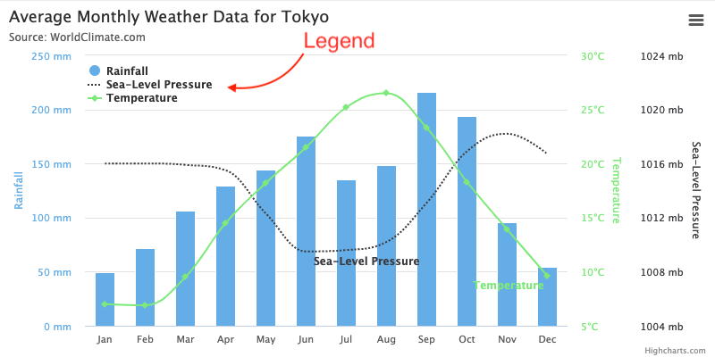

Legend
======

The legend displays the series in a chart with a predefined symbol and the name of the series. Series can be disabled and enabled from the legend.

For more information see the [API reference](https://api.highcharts.com/highcharts/legend) for legend options.