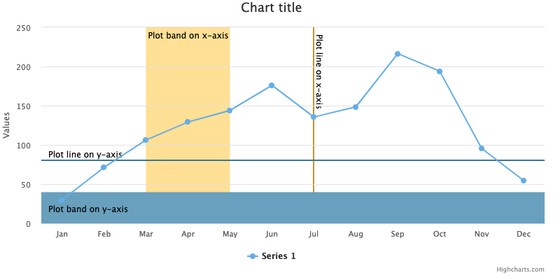
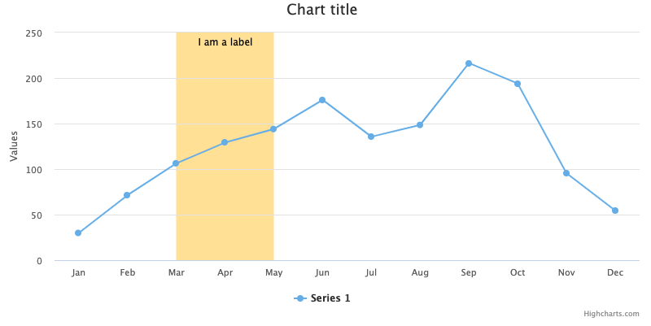
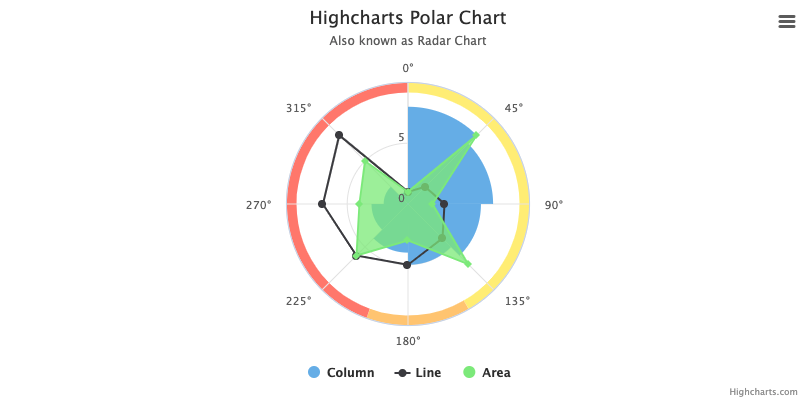

Plot bands and plot lines
=========================

Plot lines and plot bands are quite similar in use. They both have the option of color, events, id, label and zIndex. The lines and bands will always be perpendicular to the axis it is defined within. With the use of a polar chart or gauge this will create interesting examples which are described later. When a plot band/line is used on both the x- and y-axis, the plot band/line on the y-axis will be shown in front, as seen in the example below. 

Plot bands can be created either on the x-axis or the y-axis. It can also be created on both axes:

    
    xAxis: {
      ...,
      plotBands: [{
        color: 'orange', // Color value
        from: 3, // Start of the plot band
        to: 4 // End of the plot band
      }],
      plotLines: [{
        color: 'red', // Color value
        dashStyle: 'longdashdot', // Style of the plot line. Default to solid
        value: 3, // Value of where the line will appear
        width: 2 // Width of the line    
      }]
    },
    yAxis: {
      ...,
      plotBands: [{
        ... // Same as in the xAxis
      }],
      plotLines: [{
        ... // Same as in the xAxis
      }]
    }

Labels
------

The plot bands and plot lines have the option of containing a label. This is a text which will be shown on top of the band or line.

To create labels for plot bands or lines you can add the object "label":

    
    plotBands: {
      ...,
      label: { 
        text: 'I am a label', // Content of the label. 
        align: 'left', // Positioning of the label. Default to center.
        x: +10 // Amount of pixels the label will be repositioned according to the alignment. 
      }
    }

Events

"events" are an object which can be created inside a plot band or plot line object. This object defines mouse events according to the band or line. Values that are supported are click, mouseover, mouseout and mousemove.

    
    plotBands: {
      ...,
      events: {
        click: function () {
          // Action performed when event occurs
        },
        mouseover: function () {
          // Action performed when event occurs
        },
        mouseout: function () {
          // Action performed when event occurs
        },
        mousemove: function () {
          // Action performed when event occurs
        }
      }
    }

[Example](https://jsfiddle.net/gh/get/library/pure/highcharts/highcharts/tree/master/samples/highcharts/xaxis/plotbands-events/) of how events can be used.

Dynamically update
------------------

After render time a chart can be updated with new plot bands or lines, or if you want some can be removed. This is done by using the functions addPlotBand(), addPlotLine(), removePlotBand() or removePlotLine(). With use of these functions the chart allows for interaction with the user. 

When removing a plot band or line it is critical that the object which should be removed has been given an id. Without it the object cannot be recognized and the function cannot be executed.

Some simple examples of how a plot band can be [added](https://jsfiddle.net/gh/get/library/pure/highcharts/highcharts/tree/master/samples/highcharts/members/axis-addplotband/) to the chart and how it can be [removed](https://jsfiddle.net/gh/get/library/pure/highcharts/highcharts/tree/master/samples/highcharts/xaxis/plotbands-id/).

Plot bands and lines in polar charts and gauges
-----------------------------------------------

With a plot band in a polar chart or a gauge, the band will form as a concentric circle around the chart.  When used inside the x-axis of a polar chart the band will wrap around the outer corner of the chart. With the y-axis it will form a circle and fill the given area. Inside a gauge the band will wrap around the outer corner of the chart. The plot line will form as a straight line when used within the x-axis, and as a concentric circle used within the y-axis.

Plot bands and plot lines examples
----------------------------------

*   [Spline with plot bands](https://highcharts.com/demo/spline-plot-bands)
*   [Spline with dashed and dotted plot lines](https://jsfiddle.net/gh/get/library/pure/highcharts/highcharts/tree/master/samples/highcharts/xaxis/plotlines-dashstyle/)
*   [Removing a plot band](https://jsfiddle.net/gh/get/library/pure/highcharts/highcharts/tree/master/samples/highcharts/xaxis/plotbands-id/)
*   [Toggle plot band](https://jsfiddle.net/gh/get/library/pure/highcharts/highcharts/tree/master/samples/highcharts/members/axis-addplotband/)

For more information and examples look in the api for [plotBands](https://api.highcharts.com/highcharts/xAxis.plotBands), [plotLines](https://api.highcharts.com/highcharts/xAxis.plotLines), [addPlotBand](https://api.highcharts.com/highcharts/Axis.addPlotBand) and [addPlotLine](https://api.highcharts.com/highcharts/Axis.addPlotLine).
