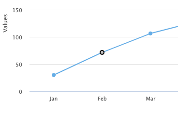
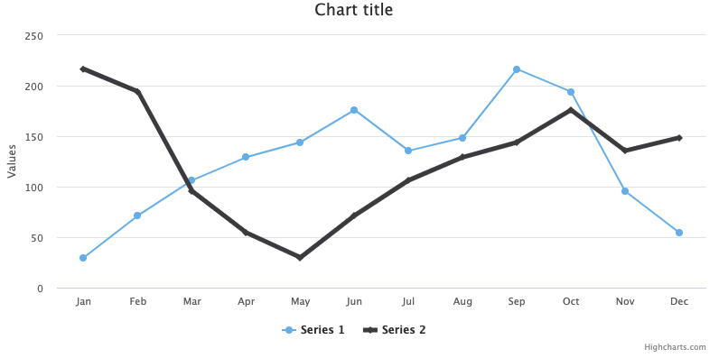
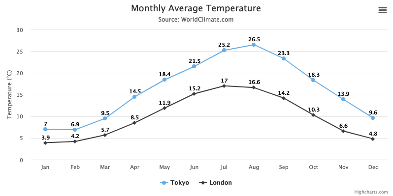
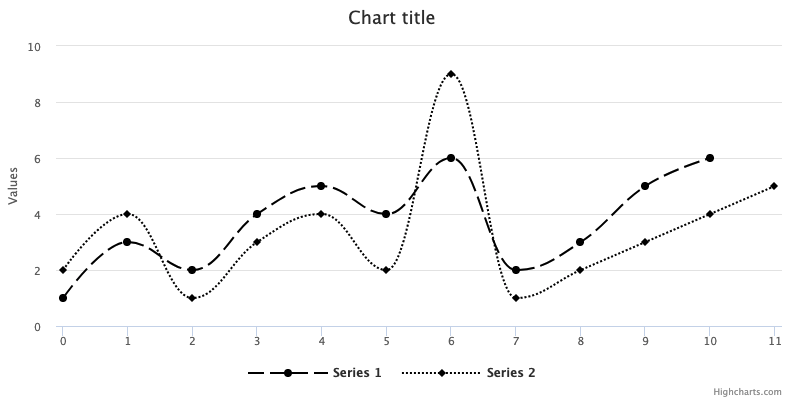

Series
======

What is a series?
-----------------

A series is a set of data, for example a line graph or one set of columns. All data plotted on a chart comes from the series object. The series object has the structure:
```js
series: [{
    name: ''
    data: []
}]
```

Note: The series object is an array, meaning it can contain several series.

The name attribute gives the series a name, which show up when hovering over the series in a chart and in the [legend](https://highcharts.com/docs/chart-concepts/legend).

The data in a series
--------------------

The actual data is represented as an array, by the data attribute, and can be presented in three ways:

1.  A list of numerical values. In this case, the numerical values will be interpreted as y values and the x values will be automatically calculated, either starting at 0 and incrementing by 1, or from the pointStart and pointInterval options. If the axis is has categories, these will be used. Example:

```js
data: [0, 5, 3, 5]
```

[Online example](https://jsfiddle.net/gh/get/jquery/1.7.1/highslide-software/highcharts.com/tree/master/samples/highcharts/chart/reflow-true/)

2.  A list of arrays with two or more values. In this case, the first value is the x value and the second is the y value. If the first value is a string, it is applied as the name of the point, and the x value is incremented following the above rules. Some series, [like arearange](https://api.highcharts.com/highcharts/series.arearange.data), accept more than two values. See API documentation for each series type. Example:

```js  
data: [[5, 2], [6, 3], [8, 2]]
```

[Online example](https://jsfiddle.net/gh/get/jquery/1.7.1/highslide-software/highcharts.com/tree/master/samples/highcharts/series/data-array-of-arrays/)

3.  A list of object with named values. In this case the objects are point configuration objects as seen under options.point. The full list of available properties can be seen from the API, for [example for line series](https://api.highcharts.com/highcharts/series.line.data). Note that for this option to work in Highstock, the total number of points must not exceed the [turboThreshold](https://api.highcharts.com/highstock/series.line.turboThreshold), or the _turboThreshold_ setting must be increased. Example:

```js   
data: [{
    name: 'Point 1',
    color: '#00FF00',
    y: 0
}, {
    name: 'Point 2',
    color: '#FF00FF',
    y: 5
}]
```
    

[Online example](https://jsfiddle.net/gh/get/jquery/1.7.1/highslide-software/highcharts.com/tree/master/samples/highcharts/series/data-array-of-objects/)

Point and marker
----------------

For cartesian charts, a point represents a (x, y) pair on the chart. Points can be given separate options inside the series data. For other chart types, the point represents other values than (x, y). For instance, in a range chart the point represents (x, low, high). In an OHLC chart the point represents (x, open, high, low, close). In a pie chart or gauge, the point represents a single value.

The point option can be applied to all charts. Here is an example showing how to edit the color of a specific point:

```js
series: [{
    data: [29.9, 71.5, 106.4, 129.2, 144.0, 176.0, 135.6, 148.5,
            { y: 216.4, color: '#BF0B23'}, 194.1, 95.6, 54.4]
}]
```
    

Line, spline, area and areaspline charts have the option to display point markers, these are slightly different from the point option because they enable altering the style and shape of the point marker.

Here is an example showing how to alter the color and size of a marker on a specific point.

```js
series: [{
    data: [29.9, 71.5, 106.4, 129.2, 144.0, 176.0, 135.6, 148.5,
    {y: 216.4, marker: { fillColor: '#BF0B23', radius: 10 } }, 194.1, 95.6, 54.4]
}]
```
    

## Series options

The series options can be defined in two places within the Highchars options structure.

*   General options that apply to multiple series are defined in the [plotOptions](https://api.highcharts.com/highcharts/plotOptions). To set general options for all series in the chart, use [plotOptions.series](https://api.highcharts.com/highcharts/plotOptions.series). To set general options for a specific chart type, each chart type has its own collection of plotOptions.
*   Specific options for each series are defined in the [series](https://api.highcharts.com/highcharts/series) options structure. All options that are listed for the plotOptions structure, can also be set in the specific series definition. Some options, like _data_, _id_ or _name_, only make sense for specific series.

Here is an overview over the most common options that can be applied to a data series:

### Animation

Allows disabling or altering the characteristics of the initial animation of a series. Animation is enabled by default.

### Color

Allows changing the color of a series.

### Point selection

Allows the selection and highlighting of a single point. Can be used to remove, edit or display information about a point.



[Try it here](https://jsfiddle.net/gh/get/jquery/1.7.1/highslide-software/highcharts.com/tree/master/samples/highcharts/plotoptions/series-allowpointselect-line/)

Code to enable point selection:

```js
plotOptions: {
    series: {
        allowPointSelect: true
    }
}
```
    

Code to get the selected points:

```js
var selectedPoints = chart.getSelectedPoints();
```
    

### Line width

Allows altering the width of a line.



[Try it here](https://jsfiddle.net/gh/get/jquery/1.7.1/highslide-software/highcharts.com/tree/master/samples/highcharts/plotoptions/series-linewidth-specific/)

Code to alter line width:

```js
series: [{
    data: [216.4, 194.1, 95.6],
    lineWidth: 5}],
```

### Stacking

Stacking allows series to be placed on top of each other without overlapping. See [Stacking charts](https://highcharts.com/docs/advanced-chart-features/stacking-charts) for more information.

### Cursor

Allows the cursor to change appearence to indicate that points and series are clickable.

### Data labels

Allows data labels to be displayed for each point of data in a series on the chart.



[Try it here](https://jsfiddle.net/gh/get/jquery/1.7.2/highslide-software/highcharts.com/tree/master/samples/highcharts/demo/line-labels/)

Code example showing how to enable datalabels:

```js
plotOptions: {
    line: {
        dataLabels: {
            enabled: true
        }
    }
},
```
    

Note: You may wish to disable mouse tracking, which highlights the series and points the mouse hovers over (tooltips will not show if mouse tracking is disabled).

The text displayed on datalabels may also be be customized by using the formatter option. See [API reference](https://api.highcharts.com/highcharts/plotOptions.series.dataLabels) for more options.

### Dash style

Allows to use dashed lines instead of solid, there are several different dash options available.



[Try it here](https://jsfiddle.net/gh/get/jquery/1.7.1/highslide-software/highcharts.com/tree/master/samples/highcharts/plotoptions/series-dashstyle/)

Code to set dashed lines for a individual series (the dashStyle can also be set in plotOptions):

```js
series: [{
    data: [1, 3, 2, 4, 5, 4, 6, 2, 3, 5, 6],
    dashStyle: 'longdash'
}]
```

### Zones

In some cases, you would want to display certain sections of the graph different, a common example is to use different colors when data falls in a certain range.  This effect can be achieved by using `zones`.  By default zoning is done on the yAxis, but this can be easily changed by setting the `zoneAxis` variable on the series.  For the zoning itself, you have to define an array called `zones` where each entry corresponds to a zone, delimited by a parameter `value`, which is the point up to which the zones goes.  The settings that can be overwritten for each zone are color, fillColor and dashStyle.

<iframe style="width: 100%; height: 475px;" src=https://www.highcharts.com/samples/embed/highcharts/series/color-zones-simple allow="fullscreen"></iframe>

Code used for the zoning:

```js
zones: [{  
    value: 0,  
    color: '#f7a35c'  
}, {  
    value: 10,  
    color: '#7cb5ec'  
}, {  
    color: '#90ed7d'  
}]
```

Another common use of this is to style future, estimated data points differently.

<iframe style="width: 100%; height: 475px;" src=https://www.highcharts.com/samples/embed/highcharts/series/color-zones-dashstyle-dot allow="fullscreen"></iframe>

Code used for the zoning:

```js
zoneAxis: 'x',
zones: [{
    value: 8
}, {
    dashStyle: 'dot'
}]
```

See the [API](https://api.highcharts.com/highcharts/plotOptions.series.zones) for more information.