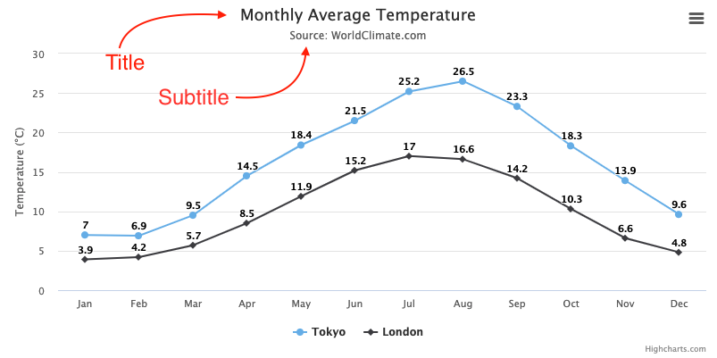

Title and subtitle
==================

The title is by default displayed at the top of the chart, and an optional subtitle can be shown beneath it.

The title and subtitle can be set as shown in the example below.

    
    title: {
        text: 'My custom title'
    },
    subtitle: {
        text: 'My custom subtitle'
    }
    

The title and subtitle can also be moved around by the default attributes of the title and subtitle options (align, float, margin, verticalAlign, x, y). For all available options, see [options.title](https://api.highcharts.com/highcharts/title) and [options.subtitle](https://api.highcharts.com/highcharts/subtitle).

Titles can be modified dynamically after render time by the [Chart.setTitle](https://api.highcharts.com/class-reference/Highcharts.Chart#setTitle) method.