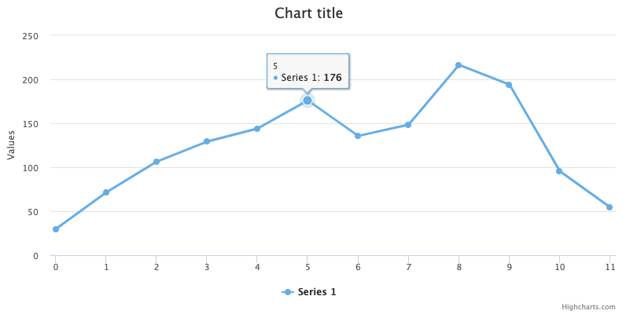
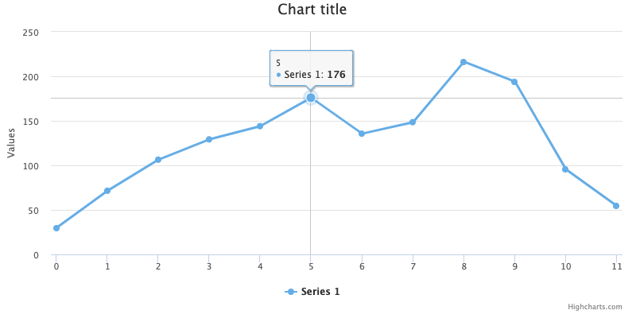

Tooltip
=======

The tooltip appears when hovering over a point in a series. By default the tooltip shows the values of the point and the name of the series. For the full set of options available for the tooltip, see [api.highcharts.com#tooltip](https://api.highcharts.com/highcharts/tooltip).



Appearance
----------

 The following code example shows the most common appearance options for tooltip:

```js
tooltip: {
    backgroundColor: '#FCFFC5',
    borderColor: 'black',
    borderRadius: 10,
    borderWidth: 3
}
```

The background color can also be set to a gradient, see [an example](https://jsfiddle.net/gh/get/jquery/1.7.1/highslide-software/highcharts.com/tree/master/samples/highcharts/tooltip/backgroundcolor-gradient/). Text properties can be set using the style option.

Tooltip formatting
------------------

The tooltip's content is rendered from a subset of HTML that can be altered in a number of ways, all in all giving the implementer full control over the content. In addition to options on the [tooltip](https://api.highcharts.com/highcharts/tooltip) configuration object, you can set the options for how each series should be represented in the tooltip by [series.tooltip](https://api.highcharts.com/highcharts/plotOptions.series.tooltip). 

*   The header part of the tooltip can be altered using the tooltip.headerFormat. In a shared tooltip, the first series' headerFormat is used.
*   The listing of each series is given in the [tooltip.pointFormat](https://api.highcharts.com/highcharts/tooltip.pointFormat) option, or an individual pointFormat for each series. 
*   The footer part can be set in the [tooltip.footerFormat](https://api.highcharts.com/highcharts/tooltip.footerFormat) option.
*   All the options above can be overridden by the [tooltip.formatter](https://api.highcharts.com/highcharts/tooltip.formatter) callback for programmatic control.

By default the tooltip only allows a subset of HTML because the HTML is parsed and rendered using SVG. By setting the [useHTML](https://api.highcharts.com/highcharts/tooltip.useHTML) option to true, the renderer switches to full HTML, which allows for instance table layouts or images inside the tooltip.

```js
tooltip: {
    formatter: function() {
        return 'The value for <b>' + this.x + '</b> is <b>' + this.y + '</b>, in series '+ this.series.name;
    }
}
```

Crosshairs
----------

Crosshairs display a line connecting the points with their corresponding axis. Crosshairs are disabled by default in Highcharts, but enabled by default in Highstock. See the full set of options for [crosshairs](https://api.highcharts.com/highcharts/tooltip.crosshairs).



Crosshairs can be enabled for the x-axis, y-axis or both:

```js
// Enable for x-axis only
tooltip: {
    crosshairs: [true]
}

// Enable for y-axis only
tooltip: {
    crosshairs: [false, true]
}

// Enable for both axes
tooltip: {
    crosshairs: [true,true]
}
```