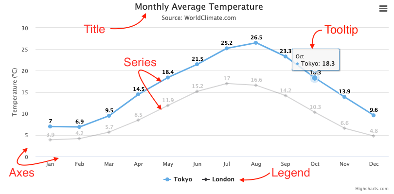

Understanding Highcharts
========================

To understand how Highcharts works, it is important to understand the various parts, or concepts, of a chart.

The image below describes the main concepts in a chart.

Title
-----

Text that describes the chart. Usually located at the top of the chart.

See [Title and subtitle](https://highcharts.com/docs/chart-concepts/title-and-subtitle) for more information.

Series
------

One or more series of data presented on the chart.

See [Series](https://highcharts.com/docs/chart-concepts/series) for more information.

Tooltip
-------

When hovering over a series or a point on the chart, you can get a tooltip that describes the values in that particular part of the chart.

See [Tooltip](https://highcharts.com/docs/chart-concepts/tooltip) for more information.

Legend
------

The legend shows the data series in the chart and allows you to enable and disable one or more series.

See [Legend](https://highcharts.com/docs/chart-concepts/legend) for more information.

Axes
----

Most charts, like the typical cartesian line chart and the column chart, have two axes to measure and categorize data: a vertical axis (y-axis) and a horizontal axis (x-axis). 3D charts have a third axis, a depth axis (z-axis). Polar charts, also known as radar charts, only have one axis that spans around the perimeter of the chart. Gauge charts, also known as speedometer charts, can even have a single value axis. Pie charts, however, have no axes.

See [Axes](https://highcharts.com/docs/chart-concepts/axes) for more information.
