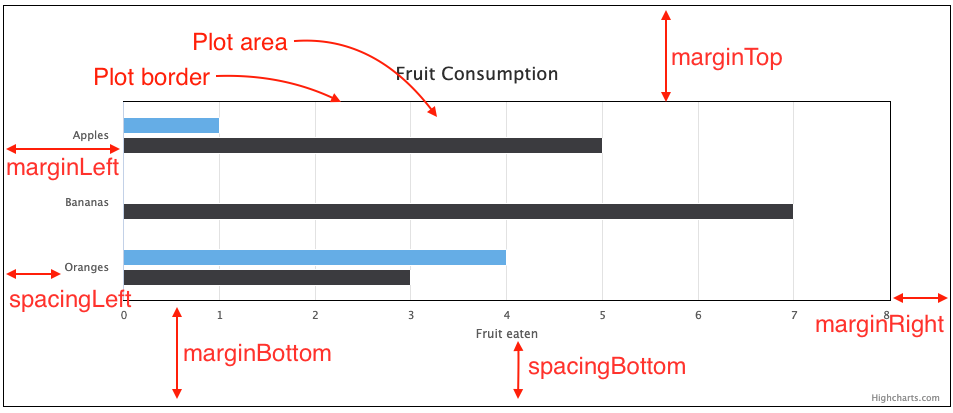

Design and style
================

All Highcharts elements are customizable through options. 

Layout and positioning
----------------------

Most Highcharts elements displayed on a chart can be positioned using x and y values relative to the top left corner and using the "align" and "verticalAlign" options. The "align" option can have the values 'left', 'right' and 'center'. The "verticalAlign" align option can have the values 'top', 'bottom' and 'middle'.

### Chart

The chart's position in the HTML page is defined by the position of the container div. Height and width is set either by setting a height and width of the container div, or by setting the [chart.height](https://api.highcharts.com/highcharts/chart.height) and [chart.width](https://api.highcharts.com/highcharts/chart.width) Highcharts options.

The _plot area_ is the square area within the axes, where the series are drawn. There are two sets of options that decide where the plot area is placed within the chart. The _margin_ options (marginLeft, marginTop etc) give the margin to the actual plot area and does not apply to other elements on the chart (labels, legend etc). The _spacing_ options (spacingLeft, spacingTop etc) decide the padding between the outer area and all elements inside a chart. In this mode, the chart is adjusted to make room for title and legend, axis labels etc. By default, the margins are null. Margins are only used in legacy charts as well as in situations where you want to make sure plot areas are align between multiple charts. Margins override their counterpart spacing options.

    
    chart: {
            // Edit chart spacing
            spacingBottom: 15,
            spacingTop: 10,
            spacingLeft: 10,
            spacingRight: 10,
    
            // Explicitly tell the width and height of a chart
            width: null,
            height: null
    }

### Credits

Credits can be moved around using the "position" option:

    
    credits: {
        position: {
            align: 'left',
            verticalAlign: 'bottom',
            x: 10,
            y: -10
        }
    }

See [api.highcharts.com#credits](https://api.highcharts.com/highcharts/credits) for full option set.

### Axis labels

Axis labels can be placed relative to the plot area using the "align" option, "x" and "y" options.

    
    labels: {
        align: 'right',
        x: -10,
        y: 0
    }
    

They can also be rotated using the "rotate" option. Font styling for the axis labels are given through the xAxis.labels.style options. See [xAxis.labels](https://api.highcharts.com/highcharts/xAxis.labels) for full option set.

### Legend

The legend is by default placed at the bottom of the chart in the center. This can be changed by the "align" and "verticalAlign" options. The legend can also be positioned anywhere in the chart area using the "floating" option. This will cause the legend to float freely over the plot area.

    
    legend:{
         align: 'left',
         verticalAlign: 'top',
         floating: true        
    }
    

The legend can also be positioned using the "x" and "y" options.

See [api.highcharts.com#legend](https://api.highcharts.com/highcharts/legend) for full option set.

### Title and subtitle

The title and subtitle can be positioned using the "align", "verticalAlign", "x" and "y" options. They can also float setting the "floating" option to true.

General text styling is set in the _style_ option. The text can also be styled inline using spans and CSS.

    
    title: {
        text: 'Example with **bold** text',
        floating: true,
        align: 'right',
        x: -30,
        y: 30
    }
    

### Export

The export buttons can be styled through options given in the [navigation](https://api.highcharts.com/highcharts/navigation) and [exporting.buttons](https://api.highcharts.com/highcharts/exporting.buttons).

Borders
-------

A chart can have two borders that are both disabled by default.

*   The _outer border_ is enabled by giving [chart.borderWidth](https://api.highcharts.com/highcharts/chart.borderWidth) a pixel value. It can be further styled by other options like chart.borderRadius, chart.borderColor. These borders will also be part of the exported chart. If you want a border that is not visible in the export, using a CSS border on the container div may be a good alternative.

*   The _plot border_ is the inner border around the plot area, marked with orange in the figure above. This border is enabled by giving [chart.plotBorderWidth](https://api.highcharts.com/highcharts/chart.plotBorderWidth) a pixel value. Its color is set by chart.plotBorderColor.

Both these borders can be complemented by a shadow through the [chart.shadow](https://api.highcharts.com/highcharts/chart.shadow) or [chart.plotShadow](https://api.highcharts.com/highcharts/chart.plotShadow) options.

Backgrounds
-----------

The _chart area_ accepts a background color through the [chart.backgroundColor](https://api.highcharts.com/highcharts/chart.backgroundColor) option. Advanced backgrounds and background images may also be applied to the HTML container, but won't be visible until the chart.backgroundColor is set to null. 

The _plot area_ accepts a background color through the [chart.plotBackgroundColor](https://api.highcharts.com/highcharts/chart.plotBackgroundColor) option. It also has a [chart.plotBackgroundImage](https://api.highcharts.com#chart.plotBackgroundImage) option to allow setting image backgrounds. 

Fonts
-----

A global font family can be set using the [chart.style](https://api.highcharts.com/highcharts/chart.style) option:

    
    Highcharts.setOptions({
        chart: {
            style: {
                fontFamily: 'serif'
            }
        }
    });

All layout elements of the chart that include text, have a style option that allow setting text related CSS properties. There are options like [xAxis.labels.style](https://api.highcharts.com/highcharts/xAxis.labels.style), [title.style](https://api.highcharts.com/highcharts/title.style), [legend.itemStyle](https://api.highcharts.com/highcharts/legend.itemStyle) to mention a few. If you go to [api.highcharts.com](https://api.highcharts.com) and search for "style" you'll get the full list.

Style properties are given in camel case like in JavaScript. So `fontFamily` will work, but `"font-family"` will not.

Common for all these is that all CSS is set to the related SVG/HTML/VML element, but not all have any effect. These configurations are meant for styling text, so properties like color, textUnderline, fontSize, fontFamily, textShadow etc. will make good sense. Other properties, like margin, padding and other layout related properties will not have an effect (or even an unintended effect) and should not be used. Layout is instead handled by specific Highcharts layout options.

Shadows
-------

Many layout elements including series types in Highcharts have shadow options. Go to [api.highcharts.com](https://api.highcharts.com) and search for "shadow" to see the full list. The shadow can be false, or true to display the shadow. In addition to that, the shadow can be an object configuration containing color, offsetX, offsetY, opacity and width. For instance, the options can be used to add a glow to the graphs: 

    
    shadow: {
        color: 'yellow',
        width: 10,
        offsetX: 0,
        offsetY: 0
    }

See it [demonstrated at jsFiddle](https://jsfiddle.net/highcharts/jYLXN/).

Styling axes
------------

Several graphic elements are associated with axes.

*   The _axis line_ extends along the axis. It is styled by the [lineWidth](https://api.highcharts.com/highcharts/xAxis.lineWidth) and [lineColor](https://api.highcharts.com/highcharts/xAxis.lineColor) options. 
*   The _tick markers_ are styled by the [tickColor](https://api.highcharts.com/highcharts/xAxis.tickColor), [tickLength](https://api.highcharts.com/highcharts/xAxis.tickLength), [tickPosition](https://api.highcharts.com/highcharts/xAxis.tickPosition) and [tickWidth](https://api.highcharts.com/highcharts/xAxis.tickWidth) options.
*   If _minor ticks_ are enabled, they have similar options in minorTickColor, minorTickLength, minorTickPosition and minorTickWidth.
*   The _axis labels_ are styled according to font styling above.
*   The _grid lines_ and minor grid lines have options like [gridLineWidth](https://api.highcharts.com/highcharts/xAxis.gridLineWidth), [gridLineColor](https://api.highcharts.com/highcharts/xAxis.gridLineColor) and [gridLineDashStyle](https://api.highcharts.com/highcharts/xAxis.gridLineDashStyle).
*   In between grid lines, every other interval can be colored according to the [alternateGridColor](https://api.highcharts.com/highcharts/xAxis.alternateGridColor) option.

Tooltip
-------

See the [Tooltip concept page](https://highcharts.com/docs/chart-concepts/tooltip) for styling tooltips. 

Animation
---------

In Highcharts, animation is enabled or disabled in two separate places.

*   The [chart.animation](https://api.highcharts.com/highcharts/chart.animation) option applies to animation when anything is changed dynamically in the chart. This change can be that a series is hidden and the plot area needs to animate to update to new axis scales, the chart is altered dynamically, or any other redraw operation. When the chart is altered dynamically, the animation can be overridden in each individual method. For example, the [Series.addPoint](https://api.highcharts.com/highcharts/Series.addPoint) method takes animation as an argument.
*   The [plotOptions.series.animation](https://api.highcharts.com/highcharts/plotOptions.series.animation) option - and similar for any series type - applies only to the initial animation for this series or series type. Once the animation has run, it never runs again. 

The animation can either be set as a boolean or a configuration object. If true, it will use the 'swing' jQuery easing and a duration of 500 ms. If used as a configuration object, the following properties are supported:

*   duration - The duration of the animation in milliseconds.
*   easing - When using jQuery as the general framework, the easing can be set to linear or swing. More easing functions are available with the use of jQuery plug-ins, most notably the jQuery UI suite. See the [jQuery docs](https://api.jquery.com/animate/). When using MooTools as the general framework, use the property name transition instead of easing.