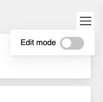
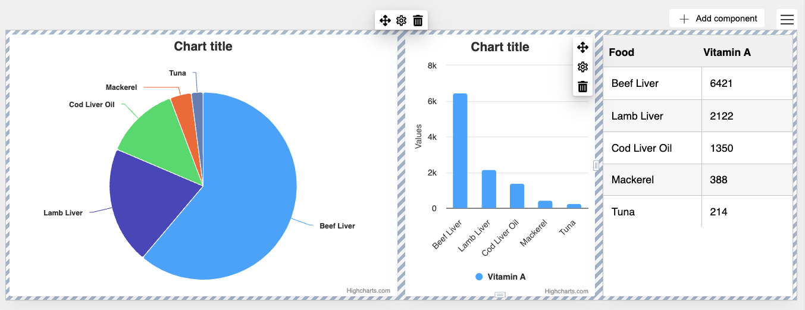
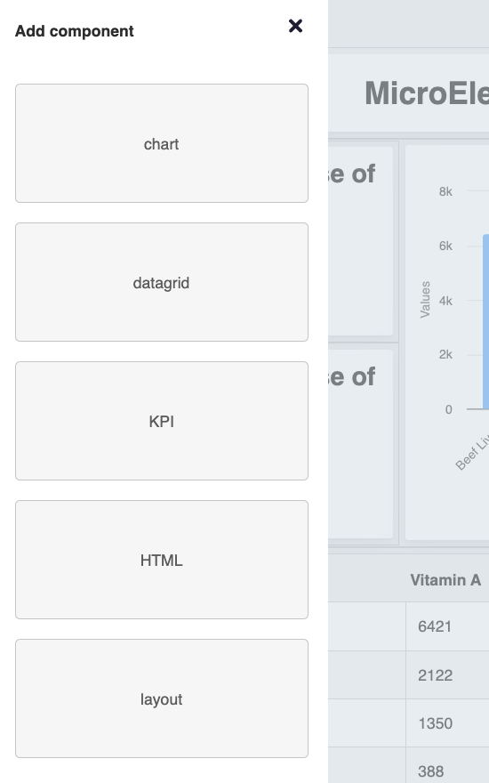

Edit mode
===

Edit mode is a mode, in which the user can change the appearance of the dashboard through the User Interface (UI).

In addition this option has to be enabled in the dashboard config:
```javascript
    editMode: {
            enabled: true,
            contextMenu: {
                enabled: true,
                items: ['editMode']
            }
        },
```

Then the edit mode option can be enabled by the context menu in the upper right corner.



When edit mode is enabled, the appearance of the dashboard changes. When a cell is hovered it gets blue border and the row, containing the cell, gets green border. Additionally both row and cell get a tooltip, which allows the user to change its position, change its options, or just delete it.



Additionally the buttons next to the burger menu are added.

The “Large”, “medium”, and “small” buttons change the width of the dashboard, to let the designer check, how the dashboard would look like for tablets and smartphones with smaller screens.

The `Add` button allows the user to add the new component. When clicked, the sidebar is shown, which lets you choose the type of component you want to add, and then by drag&drop component type can be selected and dragged to the correct place, which is also indicated by the drop marker.



The `contextMenu` option also allows you to edit, what should be inside the menu, which shows after clicking on the burger menu.  The items can either be a string like `editMode` if it is a default button, or an object, which defines the button name, `onclick` event and some more options. Here is the example snippet of context menu button configuration:
```js
    items: [{
        id: 'custom-id',
        type: 'toggle',
        text: 'Custom Name',
        events: {
            click: function () {
                // onClick Event
            }
        }
    }]
```
