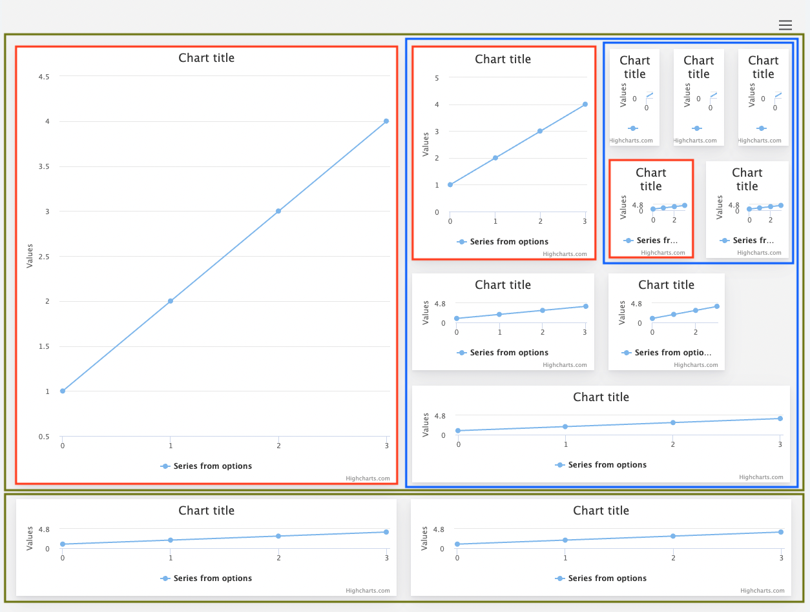

Layout
===

An essential part of any dashboard is the positioning of its components. The layout can initially be defined from the configuration object, and then changed when Edit mode is enabled. Here are the building blocks of a dashboard layout.

* Green boxes: rows
* Red boxes: individual cells
* Blue boxes: nested layout inside a cell

### Rows
Each layout consists of at least one row. The row spans through the entire width of the outer layout it's defined in. Using Edit mode, you can change its width and height, and by doing so, you also resize the cells inside the row.
Each row can have its own style defined, and its cells can be defined either as a js object or as a JSON.

### Cells
Each row consists of at least one cell. There can be many cells in the same row, and they are the containers for the components, or the nested layout.

### How the dashboard layout engine makes your dashboard responsive
The layout takes care of calculating the position of the components. Generally, each row is placed in columns, and cells are placed in rows. Things get more complicated when dealing with the resizer module, which lets you change the width and height of the row and cell. The dashboard layout engine is based on flexbox, and by setting width and height in percentage values, cell and row sizes are adjusted dynamically when the outer container resizes. This can happen in nested layouts, when several rows are positioned inside of a cell which also can be resized.