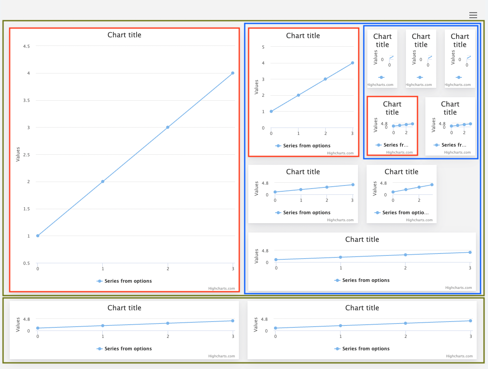

Layout
===

The vital part of any dashboard is positioning of its components. The layout can initially  be defiend from the configuration object, and then changed, when the edit mode is enabled. Here are the building blocks of layout.

* Green boxes: rows
* Red boxes: individual cells
* Blue box: nested layout inside a cell

### Rows
Each layout consists of at least one row. The row spans through all width of the outer layout, inside of which it is defined. Using edit mode you can change its width and height, and by doing so, you are also resizing the cells, that are inside.
Each row can have it’s own style defined, and its cells can be defined either as a js object or as a JSON.

### Cells
Each row consists of at least one cell. There can be many cells in the same row, and they are the containers for the components, or the nested layout.

### How dashboard layout engine makes your dashboard responsive
The layout takes care of calculating the position of the components. Generally, each row is placed in columns, and cells are placed in rows. Things get more complicated, when dealing with resizer module, which lets you to change the width and height of the row and cell. The whole dashboard layout engine is based on flexbox, and by setting width and height in percent values the values are ensured to adjust its size dynamically, when the outer container resizes. This can happen in nested layouts, when bunch of rows are positioned inside of the cell, which also can be resized.