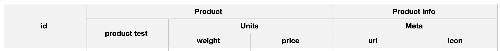

Column options in the Datagrid
===
The DataGrid provides flexible configuration options to meet your specific needs.

## Defaults
By default, the options from the [columnDefaults](https://api.highcharts.com/dashboards/#interfaces/DataGrid_Options.ColumnOptions) property are applied to all columns.
For instance, you can allow editing of cells in all columns in `columnDefaults` instead of applying an option to each column separately.

```js
columnDefaults: {
  cells: {
    editable: true
  }
}
```

## Column headers
In columns options, use [header.format](https://api.highcharts.com/dashboards/#interfaces/DataGrid_Options.ColumnHeaderOptions#format) to customize the header content for that column.

```js
columns: [{
  id: 'column1',
  header: {
    format: 'Custom header text'
  }
}]
```

### Customize headers
By default, all columns from the DataTable are imported into the DataGrid in the order they are declared.
This can be modified using the [header](https://api.highcharts.com/dashboards/#interfaces/DataGrid_Options.Options-1#header) option to define columns (or order) that you would like to display.

```js
header: ['a', 'price', 'weight']
```

Columns headers can be grouped into sections, so you can create your own multiple level header.




<iframe src="https://www.highcharts.com/samples/embed/data-grid/basic/grouped-headers" allow="fullscreen"></iframe>

```js
header: [{
  columnId: 'id'
}, {
  format: 'Product',
  columns: [{
    format: 'Product name',
    columnId: 'product'
  }, {
    format: 'Units',
    columns: [{
      columnId: 'weight'
    }, {
      columnId: 'price'
    }]
  }]
}, {
  format: 'Product info',
  columns: [{
    format: 'Meta',
    columns: [{
      columnId: 'url'
    }, {
      columnId: 'icon'
    }]
  }]
}]

```

## How to format cells
The [cells.format](https://api.highcharts.com/dashboards/#interfaces/DataGrid_Options.ColumnCellOptions#format) or [cells.formatter](https://api.highcharts.com/dashboards/#interfaces/DataGrid_Options.ColumnCellOptions#formatter) option allow you to customize the cells content and format in that column.


```js
columns: [{
  id: 'column1',
  cells: {
    formatter: function () {
      return 'V: ' + this.value;
    }
  }
}, {
  id: 'column2',
  cells: {
    format: '{value}$'
  }
}]
```

### How to edit cells
Each cell in a column can be edited directly by the end user through a double-click. Set the [cells.editable](https://api.highcharts.com/dashboards/#interfaces/DataGrid_Options.ColumnCellOptions#editable) option to true.

```js
columns: [{
  id: 'column1',
  cells: {
    editable: true
  }
}]
```

You can also use the [columnDefaults.cell.editable](https://api.highcharts.com/dashboards/#interfaces/DataGrid_Options.ColumnCellOptions#editable) property to enable editing of all cells in the DataGrid. This default setting can then be overridden by one or more columns if needed.

## Events
The DataGrid supports event listeners that can be added to the column [events](https://api.highcharts.com/dashboards/#interfaces/DataGrid_DataGridOptions.IndividualColumnOptions.html#events) object which will call functions when editing the cell or column.

The available events are:

 - `cell`
    - `afterEdit` - called after a cell was edited
    - `afterSetValue` - called after setting a cell value
    - `click` - called after click on a cell,
    - `dblClick` - called after double click on a cell,
    - `mouseOver` - called after mouse over a cell,
    - `mouseOut` - called after mouse out a cell
 - `column`
    - `afterResize` - called after resizing a column
    - `afterSorting` - called after sorting a column
 - `header`
    - `click` - called after a click on a column header

Example:
```js
events: {
  cell: {
    afterEdit: function () {
      // your action
    }
  },
  column: {
    afterResize: function () {
      // your action
    }
  },
  header: {
    click: function () {
      // your action
    }
  }
}
```

## Sorting

The optional `sorting` object consists of two configuration options:
- **`sortable`**: A boolean that determines whether a column can be sorted by the end user clicking on the column header.

- **`order`**: Specifies the initial sorting order for a column. It can be set to `'asc'` (ascending) or `'desc'` (descending). If `order` is defined in multiple columns only the last one will be considered.

See the [API reference](https://api.highcharts.com/dashboards/#interfaces/DataGrid_Options.ColumnOptions#sorting).

When the `sortable` option is enabled, clicking on the header will toggle the sorting order.

The sorting options are available for the individual `columns`.

```js
columns: [{
  id: 'column1',
  sorting: {
    sortable: true,
    order: 'desc'
  }
}]
```

But you can also turn off `sortable` for all columns using the [`columnDefaults`](https://api.highcharts.com/dashboards/#interfaces/DataGrid_Options.ColumnOptions) option as described in the first point.

```js
columnDefaults {
  sorting: {
    sortable: false
  }
}
```

Additionally, you can programmatically sort a column using the [`column.sorting.setOrder`](https://api.highcharts.com/dashboards/#classes/DataGrid_Table_Actions_ColumnSorting.ColumnSorting#setOrder) method, even if the sortable option is turned off.
