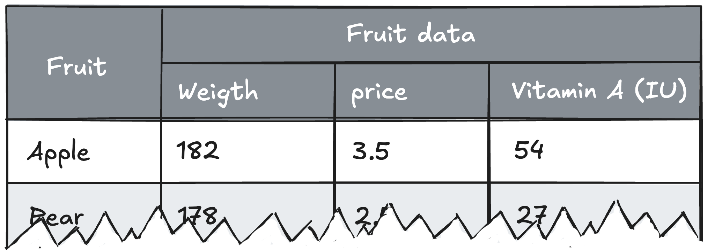

# Header options

By default, all columns from the DataTable are imported into the DataGrid in the order they are declared. Use the header[] option if you need to exclude certain columns and/or change their order. In addition, this option can be used to group headers in a hierarchical structure.



## The header[] structure

Let's look at a basic example that produces the illustration above:

```js
{
    dataTable: {
        columns: {
            product: ["Apple", "Pear"],
            weight: [182, 178],
            price: [3.5, 2.5],
            vitamin_a: [54,27],
            in_stock: [true, false]
        }
    },
    header: [
        {
            columnId: "product",
            format: "Fruit"
        },
        {
            format: "Fruit data",
            accessibility: {
                description: "Header spanning three sub-headers"
            },
            columns: [
                "weight",
                "price",
                {
                    columnId: "vitamin_a",
                    format: "Vitamin A (IU)"
                }
            ]
        }
    ],
    columns: [
        {
            id: "weight",
            header: {
                format: "Weight"
            }
        }
    ]
}
```

The `header[]` and `header[].columns[]` option arrays can be a mix of strings and objects. The string variant is a shortcut reference to the key in the DataTable. If you need to e.g. modify the header cell format, use the object variant with `columnId` as the reference.

Walktrough of some important elements:

1. **Renaming a header cell:** The first item in the `header[]` array renames the header cell to "Fruit" instead of the default "products" from the DataTable.
2. **Creating a new header group:** The second item doesn't have a `columnId` reference, so a new header cell called "Fruit data" is rendered. An `aria-description` attribute is added for improved accessibility.
3. **Defining grouped columns:** In `header[].columns[]`, we define which columns are rendered below the "Fruit data" header cell. These will then be grouped headers.
4. **Inherit column configuration:** "weight" and "price" are string variants of the reference to the key in DataTable. However, since "weight" is also referenced from the root `columns[]` option array that configuration takes precedence over the default key from the DataTable.
5. **Exluding columns**: The "in_stock" column from the DataTable is not referenced in `header[]`, so it is not rendered. This means that `header[]` can be used to exclude columns from the original DataTable.

Note that you can group headers however deep you want, by nesting the `columns[]` option array.

## Advanced example

This example shows deeper nesting of `columns[]`:

<iframe src="https://www.highcharts.com/samples/embed/data-grid/basic/grouped-headers" allow="fullscreen"></iframe>

## Summary

By using the `header[]` option, you have full control over which columns are displayed, their order, and how they are grouped and formatted in the DataGrid.

With the exception of header grouping and order you can also use the root `columns[]` option to e.g. change header cell format and exclude columns, and the best approach depends on your specific use case.

Learn more about `columns[]` in our [Columns article](https://www.highcharts.com/docs/datagrid/columns).
