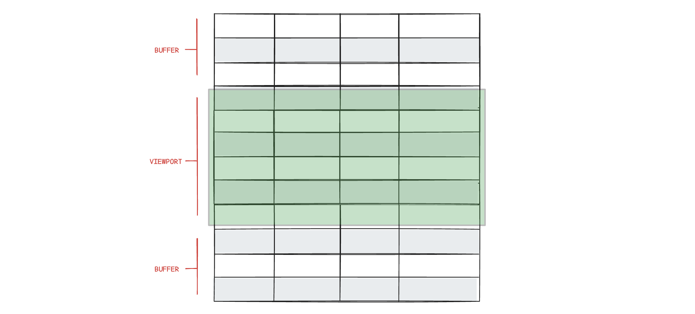

# Performance and rendering
Row virtualization is a performance optimization technique used in DataGrid.  Instead of rendering all the rows of data at once, which can be thousands of entries, row virtualization renders only the rows that are currently visible within the user's viewport (plus a small buffer). As the user scrolls, the DataGrid dynamically renders new rows and removes those that scroll out of view.



This technique significantly enhances DataGrid performance, leading to faster load times and efficient updates. Row virtualization reduces memory consumption, allowing the application to handle large datasets smoothly without compromising performance. Users benefit from a smoother experience with fluid scrolling and more responsive interactions when e.g. sorting rows.

## Optimizing performance
```js
{
    rendering: {
        rows: {
            bufferSize: 3, // default is 10
            strictHeights: true // default is false
        }
    }
}
```

The [`bufferSize`](https://api.highcharts.com/dashboards/#interfaces/DataGrid_Options.RowsSettings#bufferSize) and [`strictHeights`](https://api.highcharts.com/dashboards/#interfaces/DataGrid_Options.RowsSettings#strictHeights) options can be adjusted to optimize performance and smoothness of scrolling based on your spesific use case and preferences. 

### buffersize
Defines the number of rows rendered outside the viewport (the buffer) during scrolling. A small buffer leads to faster initial rendering, and increased performance on sorting and scroll. A larger buffer means slower initial rendering, but might decrease flicker effect on fast scrolling.

The default [`bufferSize`](https://api.highcharts.com/dashboards/#interfaces/DataGrid_Options.RowsSettings#bufferSize) of 10 should be optimal in most cases. 

### strictHeights
By default, rows adjust their height to fit all content, which can reduce performance and scrolling smoothness. Setting `strictHeights: true` ensures all rows have a uniform height, truncating multiline text with an ellipsis. This skips height calculations and boosts performance.

## Rendering
```js
{
    rendering: {
        table: {
            className: "custom_table_class"
        },
        header: {
            enabled: false // default is true
        },
        columns: {
            distribution: "fixed" // default is "full"
        }
    }
}
```
These options can be used to configure how the table should be rendered.

`table.className` is appended to the `<table>` element, and can be used to [style the DataGrid by CSS](https://www.highcharts.com/docs/datagrid/style-by-css).

`header.enabled: false` disables all [column headers](https://www.highcharts.com/docs/datagrid/header) by not rendering the `thead` element.

`columns.distribution` is used to configure initial column widths.

`columns.distribution:"full"` renders a full width (`width: 100%;`) responsive table with evenly distributed column widths. `columns.distribution:"fixed"` renders a table were columns have a fixed width in pixels. Should be set to support your spesific use case.


