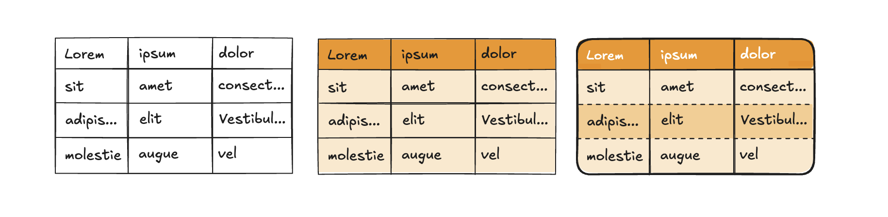

# Theming in Highcharts DataGrid



Highcharts DataGrid is built with theming in mind, allowing you to easily adapt its styles to match your brand and preferences. While it’s possible to customize the grid using standard CSS overrides, we **strongly recommend** leveraging [CSS custom properties](https://developer.mozilla.org/en-US/docs/Web/CSS/Using_CSS_custom_properties) (variables) for a more robust and flexible approach. Highcharts DataGrid ships with a [selection of predefined variables](https://www.highcharts.com/docs/datagrid/theming-variables).

Using CSS variables ensures consistent theming while avoiding common issues like CSS specificity conflicts. Overriding default styles directly can disrupt functionality, as some styles are critical to the datagrid’s operation. Using variables also **limits the chance of breaking changes** to your styles when upgrading to new versions of Highcharts DataGrid. CSS variables provide a safe, efficient, and reliable way to customize the datagrid without compromising performance.

## Variable Inheritance

CSS variables naturally inherit through the datagrid’s structure in a logical cascade: from `<table>` to `<tbody>` and `<thead>`. For example, the variable `--border-width` applies to the entire table by default and cascades to rows, columns, and cells unless overridden by more specific variables like `--row-border-width`.

In the example below, a custom theme renders a 3px solid black border around the table and between rows and columns. The last two variables override the row border’s width and style, but the row border color inherits from `--border-color`.

```css
.theme-custom {
  --border-width: 3px;
  --border-style: solid;
  --border-color: #000;

  --row-border-width: 1px;
  --row-border-style: dashed;
}
```

This cascading behavior lets you define high-level styles at the table level and refine them progressively for specific sections, avoiding repetitive declarations. Most variables follow this principle, ensuring consistent and efficient theming across your datagrid.

## Theme Inheritance

In addition to variable inheritance, Highcharts DataGrid supports **theme inheritance**, allowing you to build on a base theme and refine it for specific use cases. For instance, you can create a `.theme-brand` for your default brand styling and extend it with a `.theme-brand-big` variant for larger displays.

In the example below, a base theme defines a custom font and font size. The extended theme modifies the font size for specific use cases.

```css
.theme-brand {
  --font-family: "Brand Font", Arial, sans-serif;
  --font-size: 12px;
}

.theme-brand-big {
  --font-size: 16px;
}
```

Themes can be nested as deeply as needed, allowing you to adapt the grid for various scenarios like accessibility, large screens, or brand variants. This approach keeps your CSS clean and manageable while offering extensive customization options.

## Applying Themes with the API

Once you’ve created your custom theme(s) in CSS, you can apply them using the `rendering.theme` option. Highcharts DataGrid includes a default theme, `.hcdg-theme-default`, which is enabled by default. To build on this default theme, include it in your configuration:

```js
{
  rendering: {
    theme: "hcdg-theme-default theme-custom";
  }
}
```

To create a custom theme from scratch, exclude the default theme:

```js
{
  rendering: {
    theme: "theme-custom";
  }
}
```

The theme class is added to the `<div class="highcharts-datagrid-container theme-custom">` element, which wraps the `<table>` and other datagrid components like credits.

## Dark Mode Support

The default Highcharts DataGrid theme includes a color scheme that supports both light and dark modes. If you build your custom theme on top of the default one and leave color variables unchanged, the default colors will automatically support dark mode.

If you create a theme from scratch or modify color variables, you should define dark mode-specific colors as well:

```css
.theme-custom {
  --border-width: 3px;
  --border-style: solid;
  --border-color: #000;
}

@media (prefers-color-scheme: dark) {
  .theme-custom {
    --border-color: #fff;
  }
}
```

Variable inheritance applies here too, so you only need to override variables that differ in dark mode.

By following these practices, you can create flexible, maintainable themes that enhance your datagrid’s appearance while ensuring functionality and compatibility.
