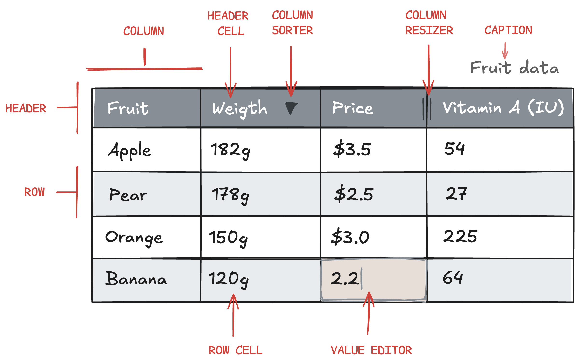

# Understanding DataGrid
At its core, the DataGrid consists of a data source rendered in x number of columns and rows. Many of the available configuration options apply to the columns and their corresponding row and header cells.



The following provides an introduction to the various root configuration objects in DataGrid:

## dataTable
```js
{
    dataTable: {
        columns: {
            product: ["Apple", "Pear", "Orange", "Banana"],
            weight: [182, 178, 150, 120],
            price: [3.5, 2.5, 3, 2.2],
            vitamin_a: [54,27,225,64]
        }
    }
}
```

The `dataTable` object is the only required option for proper rendering of the DataGrid, and `dataTable.columns` creates an instance of the DataTable class. This class has key-value pairs, where the key is used for the header cell, and the value is an array of values for the corresponding row cells.

Read more about [data handling and the DataTable class](https://www.highcharts.com/docs/dashboards/data-table).

## columnDefaults and columns[]
```js
{
    columnDefaults: {
        cells: {
            editable: true
        }
    },
    columns: [
        {
            id: "weight",
            header: {
                format: "Weight"
            },
            cells: {
                format: "{value}g"
                editable: false
            }
        },
        {
            id: "price",
            header: {
                format: "Price"
            },
            cells: {
                format: "${value}"
            }
        }
    ]
}
```

The ' columnDefaults ' object defines default options for all columns in the DataGrid, such as the column sorter, column resizer, value editor, cell format, etc., and the `columns[]` array of objects can be used to override defaults in selected columns if needed. Note that most options in `columnDefaults` are mirrored 1:1 in the `columns[]` array of objects.

Learn more about `columns[]` in our [Columns article](https://www.highcharts.com/docs/datagrid/columns) or see the API reference for [columndDefaults](https://api.highcharts.com/dashboards/#interfaces/DataGrid_Options.Options-1#columnDefaults) and [columns[]](https://api.highcharts.com/dashboards/#interfaces/DataGrid_Options.Options-1#columns).

## caption
```js
{
    caption: {
        text: "Title of the DataGrid";
    }
}
```

The code snippet above shows how the caption of the rendered table is inserted into the `<caption>` HTML element.

For more information on the `caption` option, see the [API reference](https://api.highcharts.com/dashboards/#interfaces/DataGrid_Options.Options-1#caption).

## header[]
```js
{
    header: [
        {
            columnId: "product"
            format: "Fruit",
        },
        "weight",
        "price"
    ]
}
```

While the format and visibility of individual columns and their header cells can be set using the `columns[]` option, the same can be achieved using the `header[]` root option. Which option to use depends on your specific use case, and `header[]` will, in some cases, be less verbose than `columns[]`.

In addition, the `header[]` option can change the order of headers and group headers in a hierarchical structure.

The [Header article](https://www.highcharts.com/docs/datagrid/header) provides more information about `header[]`.

## rendering
The `rendering` option object can be used to configure options related to performance and the rendering of the DataGrid. Example: [Rendering.rows](https://api.highcharts.com/dashboards/#classes/DataGrid_Table_Row.Row-1) represents the rows in the DataGrid.

```js
{
    rendering: {
        rows: {
            bufferSize: 5,
            strictHeights: true
        }
    }
}
```

For more information on rendering options, please read our article on [Performance and rendering](https://www.highcharts.com/docs/datagrid/performance) or see the [API reference](https://api.highcharts.com/dashboards/#interfaces/DataGrid_Options.Options-1#rendering).

## events
The DataGrid supports several event listeners that can be added to the header, columns and cells. These provide custom functionality and extendibility of the DataGrid. Read more about events in the [Events article](https://www.highcharts.com/docs/datagrid/events).
