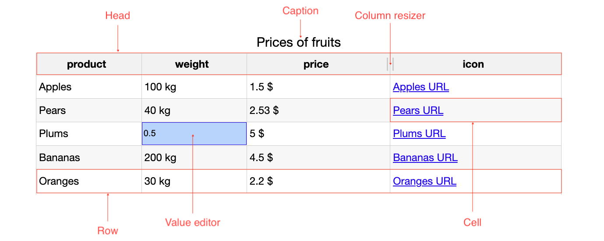

Understanding DataGrid
===

The DataGrid is a tool that can help you visualize your data in a table.



Defaults
---------
Default options for all columns.

```js
columnDefaults: {
    cells: {
        editable: true
    }
}
```

For more information on `columnDefaults` options see the [API reference](https://api.highcharts.com/dashboards/#interfaces/DataGrid_Options.Options-1#columnDefaults).

Caption
---------

The caption of the datagrid grid.

```js
caption: {
    text: 'Title of the DataGrid'
}
```

For more information on `caption` options see the [API reference](https://api.highcharts.com/dashboards/#interfaces/DataGrid_Options.Options-1#caption).

Header
---------

The [table header](https://api.highcharts.com/dashboards/#interfaces/DataGrid_Options.Options-1#header) is a special row (or group of rows) that is always at the top and, by default, contains the column IDs.
Cells in the `header` are called `headerCell`, and their contents can be edited using the [`header.format` option](https://api.highcharts.com/dashboards/#interfaces/DataGrid_DataGridOptions.ColumnOptions#format).

The header can be excluded from rendering by setting the [`rendering.header.enabled` option](https://api.highcharts.com/dashboards/#interfaces/DataGrid_Options.HeaderSettings#enabled) to `false`.

The API allows you to group header rows into sections.
More information can be found in our [Columns article](https://www.highcharts.com/docs/datagrid/columns).

Row
---------

Represents a [row](https://api.highcharts.com/dashboards/#classes/DataGrid_Table_Row.Row-1) in the data grid.

```js
rendering: {
    rows: {
        bufferSize: 5,
        strictHeights: true
    }
}
```

For more information on row rendering settings see the [API reference](https://api.highcharts.com/dashboards/#interfaces/DataGrid_Options.RowsSettings).

Column resizer
---------

Allows you to resize the entire [column](https://api.highcharts.com/dashboards/#classes/DataGrid_Table_Column.Column-1). The functionality is enabled by default,
but you can disable it in the [`columnDefaults.resizing` option](https://api.highcharts.com/dashboards/#interfaces/DataGrid_Options.ColumnOptions#resizing).

```js
columnDefaults: {
    resizing: false
}
```

For more information on the column resizer see the [API reference](https://api.highcharts.com/dashboards/#classes/DataGrid_Table_Actions_ColumnsResizer.ColumnsResizer).

Column
---------

Represents a column in the data grid. Options for a column often apply to all of the cells it contains. See the [column options API docs](https://api.highcharts.com/dashboards/#interfaces/DataGrid_Options.IndividualColumnOptions).

```js
columns: [{
    id: 'column1',
    cells: {
        format: '<h3>{value}</h3>'
    }
}, {
    id: 'column2',
    cells: {
        formatter: function () {
            return '<a href="' + this.value + '">URL</a>';
        }
    }
}]
```

For more information on the column element see the [API reference](https://api.highcharts.com/dashboards/#classes/DataGrid_Table_Column.Column-1).


Cell
---------

The basic element in the DataGrid can be formatted by [`cells.format`](https://api.highcharts.com/dashboards/#interfaces/DataGrid_Options.ColumnCellOptions#format) or [`cells.formatter`](https://api.highcharts.com/dashboards/#interfaces/DataGrid_Options.ColumnCellOptions#formatter).
You can also set the custom HTML in formatters.

For more information on the cell element see the [API reference](https://api.highcharts.com/dashboards/#classes/DataGrid_Table_Cell.Cell-1).


Value editor
---------

Allows you to edit the main value of the cell.

```js
columnDefaults: {
    cells: {
        editable: true
    }
}
```

Click on a cell and change the value.

If you declared `cells.formatter` or `cells.format` props, it will be applied to the
new value.

For more information on cell options see the [API reference](https://api.highcharts.com/dashboards/#interfaces/DataGrid_Options.ColumnCellOptions#editable).
