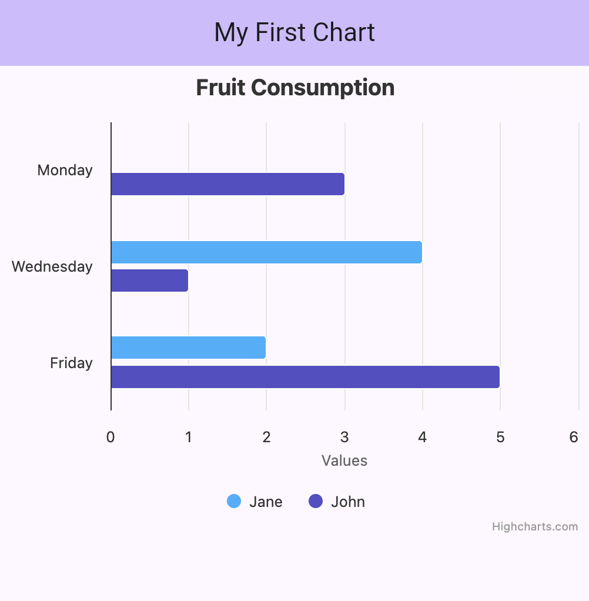

# Your first chart

With Highcharts Flutter included in your app (See [getting started](https://www.highcharts.com/docs/flutter/getting-started)) you are ready to create your first chart.

<iframe width="560" height="315" src="https://www.youtube-nocookie.com/embed/_6wvHENjpwk?si=lqFcVHcxPOF0dGoi&amp;start=127" title="YouTube: Getting started with Highcharts for Flutter: Build your first chart" frameborder="0" allow="encrypted-media; picture-in-picture; web-share" referrerpolicy="strict-origin-when-cross-origin" allowfullscreen></iframe>

We will start off by creating a simple bar chart.

1. Add a `HighchartsChart` widget in your app.

   Give it a title and set a specific width and or height for your chart.

   ```dart
    @override
    Widget build(BuildContext context) {
      return MaterialApp(
        title: 'My First Chart',
        theme: ThemeData(
          colorScheme: ColorScheme.fromSeed(seedColor: Colors.deepPurple),
          useMaterial3: true,
        ),
        home: Scaffold(
          appBar: AppBar(
          backgroundColor: Theme.of(context).colorScheme.inversePrimary,
            title: const Text('My First Chart'),
          ),
          body: SafeArea(child: Scrollbar(child: ListView(
            children: [
              // Here the HighchartsChart widget is added to a ListView
              HighchartsChart(
                HighchartsOptions(
                  title: HighchartsTitleOptions(
                    text: 'Fruit Consumption',
                  ),
                  chart: HighchartsChartOptions(
                    backgroundColor: '#FFF0',
                    height: 400
                  ),
                  xAxis: [
                    HighchartsXAxisOptions(
                      categories: ['Monday', 'Wednesday', 'Friday'],
                    ),
                  ],
                  series: [],
                ),
              ),
            ],
          ))),
        ),
      );
    }
   ```

2. In this step we add two series with data to the `HighchartsChart` widget.

   You can provide each data point as a list of axes values.

   ```dart
   HighchartsOptions(
     // ...
     series: [
       HighchartsBarSeries(
         name: 'Jane',
         data: [
           ['Monday', 0],
           ['Wednesday', 4],
           ['Friday', 2],
         ],
       ),
     ],
   )
   ```

   Or you can provide each data point as an complex object.

   ```dart
   HighchartsOptions(
     // ...
     series: [
       // ...
       HighchartsBarSeries(
         name: 'John',
         dataPoints: [
           HighchartsBarSeriesDataOptions(
             name: 'Monday',
             y: 3,
           ),
           HighchartsBarSeriesDataOptions(
             name: 'Wednesday',
             y: 1,
           ),
           HighchartsBarSeriesDataOptions(
             name: 'Friday',
             y: 5,
           ),
         ],
       ),
     ],
   )
   ```

3. Additional series options are added separately.

   ```dart
   HighchartsOptions(
     // ...
     series: [
       HighchartsBarSeries(
         name: 'Jane',
         // ...
         options: HighchartsBarSeriesOptions(
           color: 'coral' // or '#ff7f50'
         ),
       ),
       HighchartsBarSeries(
         name: 'John',
         // ...
         options: HighchartsBarSeriesOptions(
           color: 'deepskyblue' // or '#00bfff'
         ),
       ),
     ],
   ),
   ```

3. Your chart should look similar to the following picture.

   

5. Adjusting legend and series tooltips is also an easy task and allows you to change appearance and interaction.

   ```dart
   HighchartsOptions(
     // ...
     legend: HighchartsLegendOptions(
       enabled: true,
       layout: 'horizontal',
       align: 'center',
       verticalAlign: 'bottom',
     ),
     tooltip: HighchartsTooltipOptions(
       enabled: true,
       shared: true,
       valueSuffix: ' pcs',
     ),
   ),
   ```

6. One can also add callbacks to be informed about interactions and other
   events.

   ```dart
   HighchartsOptions(
     // ...
     plotOptions: HighchartsPlotOptions(
       series: HighchartsSeriesOptions(
         point: HighchartsSeriesPointOptions(
           events: HighchartsSeriesEventsOptions(
             click: HighchartsCallback((args) {
               final point = args[0];
               debugPrint('Point value: ${point['x']}, ${point['y']}');
             }),
           ),
         ),
       ),
     ),
   ),
   ```

7. Congratulations!
   With everything in place you can create stunning interactive charts in your app.

   For more information about all available options, consult our [API docs](https://api.highcharts.com/) or the [package docs](https://pub.dev/documentation/highcharts_flutter/).
