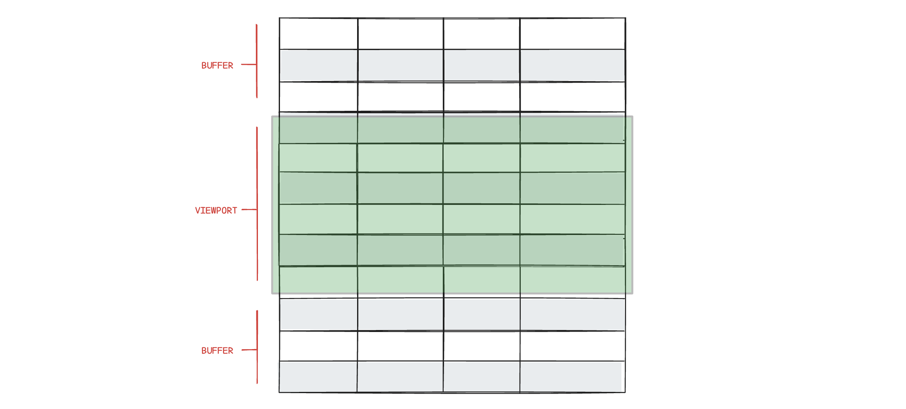

# Row virtualization

Row virtualization (also called *windowing*) is a performance technique used in Highcharts Grid to efficiently render large data sets. Instead of rendering all rows at once, the grid only renders the rows that are currently visible in the viewport, plus a small buffer (also called *overscan*) above and below.



This dramatically reduces DOM size, memory usage, and rendering time, making scrolling smooth even with tens or hundreds of thousands of rows.

## How It Works

1. **Fixed scroll container**
   The grid uses a scrollable container with a total height that represents all rows.

2. **Visible window calculation**
   Based on the scroll position and row height, the grid calculates the first and last visible row index

3. **Selective rendering**
   Only rows within this range (plus an overscan buffer) are rendered to the DOM.

4. **Positioning**
   Rendered rows are positioned using translation or top offsets so they appear in the correct place within the full dataset.

As the user scrolls, rows entering the viewport are rendered and rows leaving it are removed.

Alternatively, if you prefer to display data in discrete pages rather than continuous scrolling, you can use [Pagination](https://www.highcharts.com/docs/grid/rows/pagination) to also avoid rendering all rows at once.

## Virtualization threshold

By default, virtualization turns on when the row count exceeds 50. Below that, the grid renders as a normal HTML table with no virtualization.

Raising the threshold favors smaller datasets by keeping all rows in the DOM, which can improve copy/paste and browser search. Lowering the threshold favors larger datasets by keeping memory use predictable and avoiding long initial renders, but fewer rows exist in the DOM at any one time.

```js
rendering: {
    rows: {
        virtualizationThreshold: 100 // default is 50
    }
}
```

## Enable/disable virtualization

If you want to override the threshold, you can force virtualization on or off regardless of row count.

Force `virtualization: true` when you want consistent scrolling performance or expect the row count to grow. The tradeoff is that only visible rows exist in the DOM. Force `virtualization: false` for small, static tables or when you need all rows present for bulk DOM operations, but large datasets can render slowly and use more memory.

```js
rendering: {
    rows: {
        virtualization: true
    }
}
```

## Buffer size (overscan)

The `bufferSize` option controls how many extra rows are rendered above and below the visible area. A larger buffer reduces flicker while scrolling, at the cost of more DOM nodes. In most situations, the default buffer size of 10 is optimal.

Use a larger buffer for fast scrolling or heavy row content to reduce visible redraws. Use a smaller buffer to minimize DOM size and memory use, at the risk of more frequent row recycling.

```js
rendering: {
    rows: {
        bufferSize: 20 // default is 10
    }
}
```
