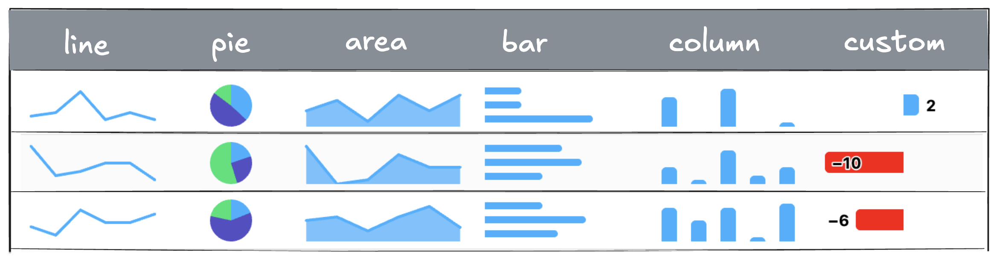

# Sparklines

**Note:** Sparklines are only available in **Highcharts Grid Pro**, and also requires a valid **Highcharts Core license**.



A [`sparkline`](https://api.highcharts.com/grid/#classes/Grid_Pro_CellRendering_Renderers_SparklineRenderer.SparklineRenderer) is a small, inline chart, typically a line, bar, or area chart, embedded within a cell to visually represent trends or patterns in data at a glance. Unlike full-size charts, sparklines are minimal and non-intrusive, making them ideal for showing changes over time or comparing values directly within rows of a grid, without leaving the context of the table.

Line, bar, column, area and pie are preconfigured as generic, minimalistic sparklines in Highcharts Grid Pro, but you can use `chartConfig` to configure these further or use other chart types. All chart types and configuration options from the [Highcharts Core](https://www.highcharts.com/products/highcharts/) charting library are available. 

## Setup
If you’re simply including the `highcharts.js` file, just make sure to load it before `grid-pro.js`. If you’re using ES Modules or importing the bundles in the opposite order, you’ll also need to manually register Highcharts by calling `SparklineRenderer.useHighcharts(Highcharts)` or `Grid.ColumnRendererRegistry.types.sparkline.useHighcharts(Highcharts)`.

Check out the [sparklines demo](https://www.highcharts.com/demo/grid/sparklines) for how to implement sparklines with different configuration options and read more below.

## Basic line sparkline

In its simplest form, given that cell data is an array of numbers, a line sparkline can be rendered using:

```js
columns: [{
    id: 'trend', // column id
    cells: {
        renderer: {
            type: 'sparkline',
        }
    }
}]
```

## Defaults
Unlike traditional charts, sparklines are typically rendered without axes, coordinates, or labels, making them ideal for summarizing trends in a small space. This is the default `chartConfig` for sparklines:

```js
{
    chart: {
        height: 40,
        animation: false,
        margin: [5, 8, 5, 8],
        backgroundColor: 'transparent',
        skipClone: true
    },
    accessibility: {
        enabled: false
    },
    tooltip: {
        enabled: false
    },
    title: {
        text: ''
    },
    credits: {
        enabled: false
    },
    xAxis: {
        visible: false
    },
    yAxis: {
        visible: false
    },
    legend: {
        enabled: false
    },
    plotOptions: {
        series: {
            borderWidth: 0,
            marker: {
                enabled: false
            },
            states: {
                hover: {
                    enabled: false
                },
                inactive: {
                    enabled: false
                }
            },
            animation: false,
            dataLabels: {
                enabled: false
            }
        },
        pie: {
            slicedOffset: 0,
            borderRadius: 0
        }
    }
}
```

## Configuration
You can configure the sparkline using the `chartOptions` API option, that supports all [Highcharts Core API options](https://api.highcharts.com/highcharts/).

```js
{
    id: 'trend', // column id
    cells: {
        renderer: {
            type: 'sparkline',
            chartOptions: {
                chart: {
                    type: 'bar'
                },
                plotOptions: {
                    series: {
                        dataLabels: {
                            enabled: true
                        }
                    }
                }
            }
        }
    }
}
```

## Performance
Sparkline supports all standard Highcharts chart options and is optimized for speed, including virtual scrolling for large datasets.

<iframe src="https://www.highcharts.com/samples/embed/grid/basic/sparklines?force-light-theme" allow="fullscreen"></iframe>
