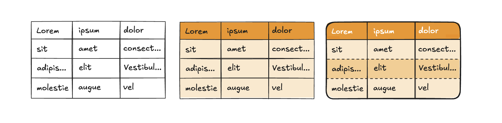

# Introduction to theming



Highcharts Grid is designed with theming in mind, making it easy to adapt its styles to match your brand and preferences. While you can customize the grid using standard CSS overrides, we **strongly recommend** leveraging [CSS custom properties](https://developer.mozilla.org/en-US/docs/Web/CSS/Using_CSS_custom_properties) (variables) whenever possible for a more robust and flexible approach. Highcharts Grid includes a [selection of predefined variables](https://www.highcharts.com/docs/grid/theming/theming-variables) for styling the overall grid, ensuring a consistent and maintainable look.

These variables cover most common styling needs, but if you use custom HTML inside elements such as table cells, you will need to style those manually with regular CSS. Since we cannot provide variables for every possible use case, this approach gives you the flexibility to handle custom elements while maintaining the core grid’s theme.

Using the included CSS variables also helps prevent breaking changes in future versions. We take great care to maintain backward compatibility, and relying on these variables ensures your custom styles remain stable across updates. Directly overriding default styles can lead to unexpected issues, whereas CSS variables provide a safe, efficient, and reliable way to customize the grid without compromising performance.

## Variable Inheritance

CSS variables naturally inherit through the grid’s structure in a logical cascade: from `<table>` to `<tbody>` and finally `<thead>`. For example, the variable `--hcg-border-width` applies to the entire table by default and cascades to rows, columns, and cells unless overridden by more specific variables like `--hcg-row-border-width`.

In the example below, a custom theme renders a 3px solid black border around the table and between rows and columns. The last two variables override the row border’s width and style, but the row border color inherits from `--hcg-border-color`.

```css
.theme-custom {
    --hcg-border-width: 3px;
    --hcg-border-style: solid;
    --hcg-border-color: #000;

    --hcg-row-border-width: 1px;
    --hcg-row-border-style: dashed;
}
```

This cascading behavior lets you define high-level styles at the table level and refine them progressively for specific sections, avoiding repetitive declarations. Most variables follow this principle, ensuring consistent and efficient theming across your grid.

## Theme Inheritance

In addition to variable inheritance, Highcharts Grid supports theme inheritance, allowing you to build on a base theme and refine it for specific use cases. For instance, you can create a `.theme-brand` for your default brand styling and extend it with a `.theme-brand-big` variant for larger displays.

In the example below, a base theme defines a custom font and font size. The extended theme modifies the font size for specific use cases.

```css
.theme-brand {
    --hcg-font-family: "Brand Font", Arial, sans-serif;
    --hcg-font-size: 12px;
}

.theme-brand-big {
    --hcg-font-size: 16px;
}
```

Themes can be nested as deeply as needed, allowing you to adapt the grid for various scenarios like accessibility, large screens, or brand variants. This approach keeps your CSS clean and manageable while offering extensive customization options.

## Applying Themes with the API

Once you’ve created your custom theme(s) in CSS, you can apply them using the `rendering.theme` option. Highcharts Grid includes a default theme, `.hcg-theme-default`, which is enabled by default. To build on this default theme, include it in your configuration:

```js
{
    rendering: {
        theme: "hcg-theme-default theme-custom";
    }
}
```

To create a custom theme from scratch, exclude the default theme:

```js
{
    rendering: {
        theme: "theme-custom";
    }
}
```

The theme class is appended to the `<div class="hcg-container theme-custom">` element, which wraps the `<table>` and other grid components.

## Dark Mode Support

The default theme (`.hcg-theme-default`) supports both light and dark modes.

If you create a theme from scratch or modify color variables in the default, you might want to define dark mode-specific colors as well:

```css
.theme-custom {
    --hcg-border-width: 3px;
    --hcg-border-style: solid;
    --hcg-border-color: #000;
}

@media (prefers-color-scheme: dark) {
    .theme-custom {
        --hcg-border-color: #fff;
    }
}
```

Variable inheritance applies here too, so you only need to override variables that differ in dark mode.

*NOTE:* Alernatively you can use the [light-dark CSS function](https://developer.mozilla.org/en-US/docs/Web/CSS/color_value/light-dark). This property has [general support only since March 2024](https://caniuse.com/?search=light-dark), so use with caution if you want to ensure support for all your users.

```css
.theme-custom {
    --hcg-border-width: 3px;
    --hcg-border-style: solid;
    --hcg-border-color: light-dark(#000, #fff);
}
```

By following these practices, you can create flexible, maintainable themes that enhance your grid’s appearance while ensuring proper functionality and backward compatibility.

Now check out the article on [theming variables](https://www.highcharts.com/docs/grid/theming/theming-variables) to get a full overview of all available variables and our [theming demo](https://www.highcharts.com/grid/demo/grid/theming/theming) to see it in practice.

