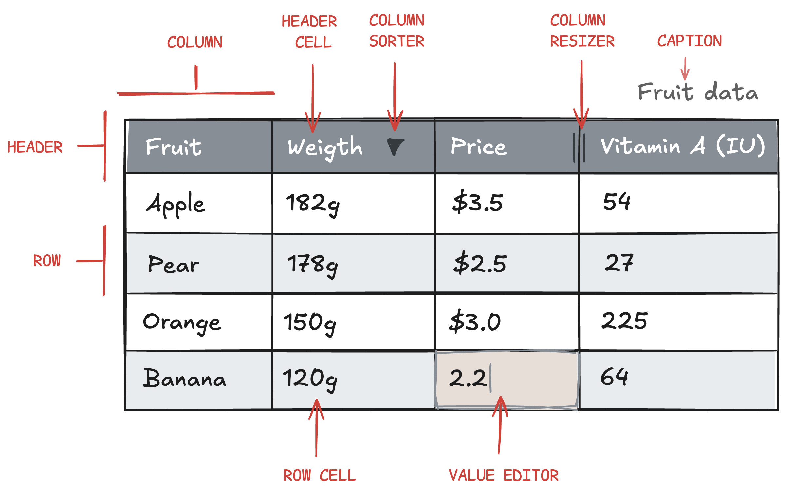

# Understanding Highcharts Grid
At its core Grid consists of a data source that is rendered in x number of columns and rows. Many of the available configuration options applies to the columns and their corresponding row and header cells.



The following provides an introduction to the various root configuration objects in Grid:

## dataTable
```js
{
    dataTable: {
        columns: {
            product: ["Apple", "Pear", "Orange", "Banana"],
            weight: [182, 178, 150, 120],
            price: [3.5, 2.5, 3, 2.2],
            vitamin_a: [54,27,225,64]
        }
    }
}
```

The `dataTable` object is the only required option for proper rendering of Grid, and `dataTable.columns` creates an instance of the DataTable class. This class has key-value pairs, where the key is used for the header cell, and the value is an array of values for the corresponding row cells.

Read more about [data handling and the DataTable class](https://www.highcharts.com/docs/dashboards/data-table).

### Data modifiers

Alternatively to serializable options, you can pass a reference to the [DataTable](https://www.highcharts.com/docs/dashboards/data-table) you want to use when rendering the Grid. This lets you, for example, apply a [Math Modifier](https://www.highcharts.com/docs/dashboards/mathmodifier-module) from Highcharts Dashboards library to it beforehand to add a new column whose values are the result of a mathematical operation on one or more existing columns.

You can read more about Data Modifiers [here](https://www.highcharts.com/docs/dashboards/data-modifiers).

## columnDefaults and columns[]
```js
{
    columnDefaults: {
        cells: {
            editMode: {
                enabled: true
            }
        }
    },
    columns: [{
        id: "weight",
        header: {
            format: "Weight"
        },
        cells: {
            format: "{value}g",
            editMode: {
                enabled: false
            }
        }
    }, {
        id: "price",
        header: {
            format: "Price"
        },
        cells: {
            format: "${value}"
        }
    }]
}
```

The ' columnDefaults ' object defines default options for all columns in the grid, such as the column sorter, column resizer, value editor, cell format, etc., and the `columns[]` array of objects can be used to override defaults in selected columns if needed. Note that most options in `columnDefaults` are mirrored 1:1 in the `columns[]` array of objects.

Learn more about `columns[]` in our [Columns article](https://www.highcharts.com/docs/grid/columns) or see the API reference for [columnDefaults](https://api.highcharts.com/grid/#interfaces/Grid_Core_Options.Options-1#columnDefaults) and [columns[]](https://api.highcharts.com/grid/#interfaces/Grid_Core_Options.Options-1#columns).

## caption
```js
{
    caption: {
        text: "Title of the Grid";
    }
}
```

The code snippet above shows how to insert a caption, or title, above the grid.

For more information on the `caption` option, see the [API reference](https://api.highcharts.com/grid/#interfaces/Grid_Core_Options.Options-1#caption).

## header[]
```js
{
    header: [
        {
            columnId: "product"
            format: "Fruit",
        },
        "weight",
        "price"
    ]
}
```

While the format and visibility of individual columns and their header cells can be set using the `columns[]` option, the same can be achieved using the `header[]` root option. Which option to use depends on your specific use case, and `header[]` will, in some cases, be less verbose than `columns[]`.

In addition, the `header[]` option can change the order of headers and group headers in a hierarchical structure.

The [Header article](https://www.highcharts.com/docs/grid/header) provides more information about `header[]`.

## accessibility
```js
{
  accessibility: {
    enabled: false,
    ...
  }
}
```
The `accessibility` option object can be used to enable/disable accessibility features such as ARIA attributes and ARIA live announcements.

For more information on accessibility options read our documentation article on [accessibility](https://www.highcharts.com/docs/grid/accessibility).

## lang
To customize the default language or wording for ARIA attributes and announcers, use the `lang.accessibility` option. In the current version of Highcharts Grid the `lang` option is solely related to [accessibility](https://www.highcharts.com/docs/grid/accessibility), but will be extended to other use cases as we add more features. Stay up to date by visiting our [changelog](https://www.highcharts.com/blog/changelog/#highcharts-grid) and [roadmap](https://www.highcharts.com/blog/roadmap/).

## rendering
The `rendering` option object can be used to configure options related to performance and the rendering of the Grid. Example: [Rendering.rows](https://api.highcharts.com/grid/#interfaces/Grid_Core_Options.RenderingSettings#rows) represents the rows in the Grid.

```js
{
    rendering: {
        rows: {
            bufferSize: 5,
            strictHeights: true
        }
    }
}
```

For more information on rendering options, please read our article on [Performance and rendering](https://www.highcharts.com/docs/grid/performance) or see the [API reference](https://api.highcharts.com/grid/#interfaces/Grid_Core_Options.RenderingSettings).

## events __grid_pro__
Highcharts Grid Pro supports several event listeners that can be added to the header, columns and cells. These provide custom functionality and extendibility of Grid. Read more about events in the [Events article](https://www.highcharts.com/docs/grid/events).

## setOptions()
When adding multiple grids to the same page, it is recommended to set default options globally using the `setOptions()` method. This approach is more efficient than configuring each Grid individually. For an overview of all default options see the [API reference](https://api.highcharts.com/grid/#interfaces/Grid_Core_Options.Options-1#columnDefaults).

```js
Grid.setOptions({
    columnDefaults: {
        sorting: {
            sortable: false
        }
    }
})
```
This example disables end user sorting for every Grid on the page.

## pagination
Pagination in Highcharts Grid allows you to split your data into manageable pages, improving both performance and user experience when working with large datasets.
The `pagination` option object can be used to enable or disable pagination, set the number of items per page, and attach event listeners for actions before and after a page change.

The main options include:
* `enabled`: Set to `true` to activate pagination.
* `itemsPerPage`: Specifies how many rows are displayed per page.
* `events`: An object with optional `beforePageChange` and `afterPageChange` callback functions, which are triggered before and after the page changes, respectively.

By configuring these options, you can control how users navigate through your data and respond to pagination events for custom behaviors.

```js
pagination: {
    enabled: true,
    itemsPerPage: 6,
    events: {
        beforePageChange: function (pg) {
            console.log('beforePageChange', pg.currentPage);
        },
        afterPageChange: function (pg) {
            console.log('afterPageChange', pg.currentPage);
        }
    }
}
```