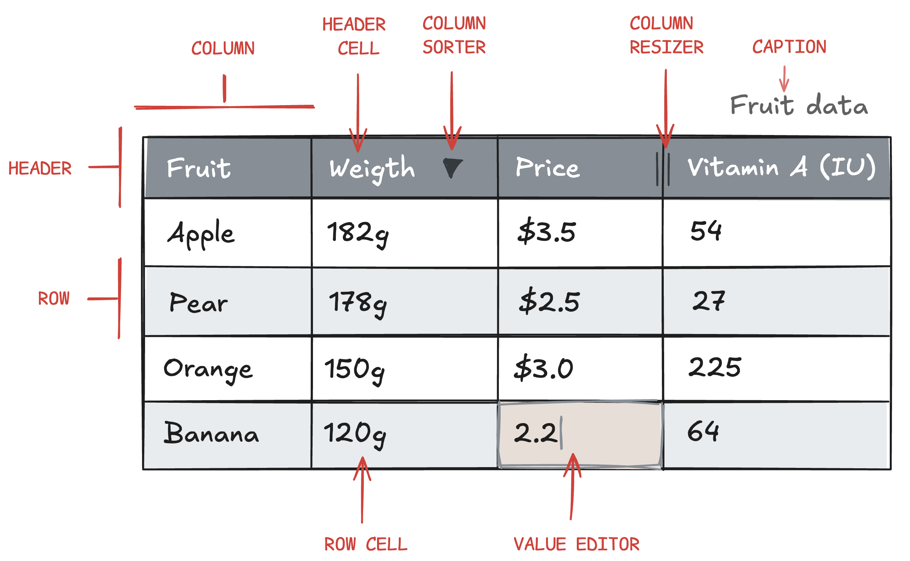

# Understanding Highcharts Grid

Highcharts Grid displays structured data in columns and rows, using a standard
HTML table as its foundation. Most Grid setups start with a data source, then
define how columns and cells should look and behave, and finally add features
such as pagination, editing, accessibility, and exporting.



## Overall structure

Most Grid setups combine a few core options:

```js
Grid.grid('container', {
    data: {
        columns: {
            product: ['Apple', 'Pear', 'Orange'],
            price: [3.5, 2.5, 3]
        }
    },
    columns: [{
        id: 'price',
        cells: {
            format: '${value}'
        }
    }],
    pagination: {
        enabled: true
    }
});
```

In practice, you will usually work with a few main topics: how data is loaded,
how columns are defined, how rows are rendered, and how cell content is
formatted or edited.

## Start here

If you are new to Grid, begin with:

- [General](https://www.highcharts.com/docs/grid/general)
- [Installation](https://www.highcharts.com/docs/grid/installation)

Then continue with the topic area that matches the part of Grid you are working
on.

## Core topics

### Data handling

Data handling covers how Grid receives data, how it stores it internally, and
whether sorting, filtering, and pagination happen in the browser or on the
server.

Start with:

- [Data handling / Overview](https://www.highcharts.com/docs/grid/data-handling/overview)
- [Data handling / Client-side](https://www.highcharts.com/docs/grid/data-handling/clientside)
- [Data handling / Server-side](https://www.highcharts.com/docs/grid/data-handling/serverside)
- [Data handling / Connectors](https://www.highcharts.com/docs/grid/data-handling/connectors)

### Columns

Columns define the structure of the Grid. This includes header labels, grouped
headers, column sizing, sorting, filtering, and column-level styling.

Start with:

- [Columns](https://www.highcharts.com/docs/grid/columns/index)
- [Header](https://www.highcharts.com/docs/grid/columns/header)
- [Grouping](https://www.highcharts.com/docs/grid/columns/grouping)
- [Resizing and width](https://www.highcharts.com/docs/grid/columns/resizing-and-width)
- [Sorting](https://www.highcharts.com/docs/grid/columns/sorting)
- [Filtering](https://www.highcharts.com/docs/grid/columns/filtering)
- [Styling and theming](https://www.highcharts.com/docs/grid/columns/styling-and-theming)

### Rows

Rows focus on the rendered dataset: row access, pagination, virtualization, and
performance when displaying large amounts of data.

Start with:

- [Rows](https://www.highcharts.com/docs/grid/rows/index)
- [Row data](https://www.highcharts.com/docs/grid/rows/data)
- [Pagination](https://www.highcharts.com/docs/grid/rows/pagination)
- [Virtualization](https://www.highcharts.com/docs/grid/rows/virtualization)
- [Performance and rendering](https://www.highcharts.com/docs/grid/rows/performance)

### Cells

Cells control how individual values are presented, styled, and formatted inside
the Grid.

Start with:

- [Cells](https://www.highcharts.com/docs/grid/cells/index)
- [Styling and theming](https://www.highcharts.com/docs/grid/cells/styling-and-theming)
- [Formatting](https://www.highcharts.com/docs/grid/cells/formatting)

### Editing __grid_pro__

Editing covers end-user value editing, built-in renderers, validation rules,
and custom editing behavior.

Start with:

- [Editing](https://www.highcharts.com/docs/grid/editing/index)
- [Renderers](https://www.highcharts.com/docs/grid/editing/renderers)
- [Validation](https://www.highcharts.com/docs/grid/editing/validation)
- [Custom renderers](https://www.highcharts.com/docs/grid/editing/custom-renderers)

### Theming

Theming covers CSS variables, theme customization, conditional styling, and
custom icons.

Start with:

- [Theming](https://www.highcharts.com/docs/grid/theming/index)
- [Grid variables](https://www.highcharts.com/docs/grid/theming/grid-variables)
- [Element variables](https://www.highcharts.com/docs/grid/theming/element-variables)
- [Conditional theming](https://www.highcharts.com/docs/grid/theming/conditional)
- [Custom icons](https://www.highcharts.com/docs/grid/theming/custom-icons)

### Frameworks

Framework articles show how to use Grid with supported frameworks.

Start with:

- [Frameworks](https://www.highcharts.com/docs/grid/frameworks/index)
- [Angular](https://www.highcharts.com/docs/grid/frameworks/angular)
- [Next.js](https://www.highcharts.com/docs/grid/frameworks/nextjs)
- [React](https://www.highcharts.com/docs/grid/frameworks/react)
- [Vue](https://www.highcharts.com/docs/grid/frameworks/vue)

## Additional topics

- [Responsive grid](https://www.highcharts.com/docs/grid/responsive-grid) for container-based layout changes
- [Events](https://www.highcharts.com/docs/grid/events) for lifecycle and interaction events
- [Accessibility](https://www.highcharts.com/docs/grid/accessibility) for screen reader support and accessibility features
- [Internationalization](https://www.highcharts.com/docs/grid/internationalization) for translated UI text and locale-aware formatting
- [Exporting data](https://www.highcharts.com/docs/grid/exporting) for CSV and JSON export
- [Sparklines](https://www.highcharts.com/docs/grid/sparklines)  for inline charts inside cells

Use this page as an overview of the main Grid concepts. Once you know which
part of the Grid you are working on, the linked topic article should be the
next step.
