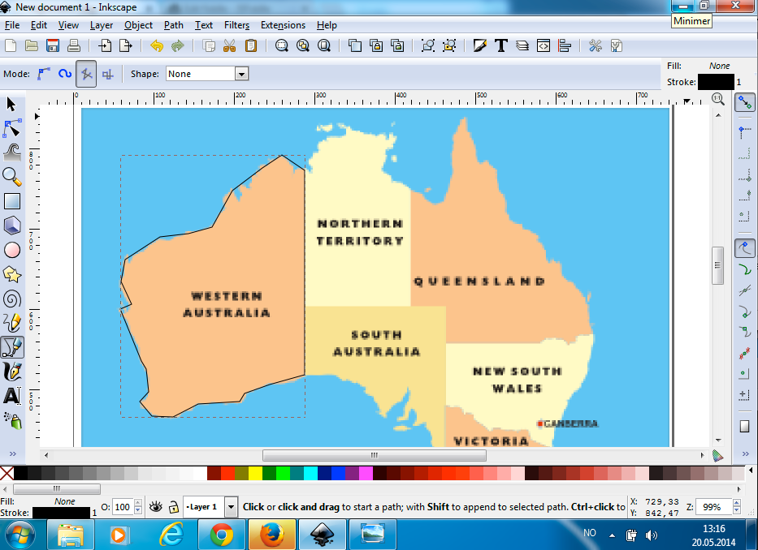
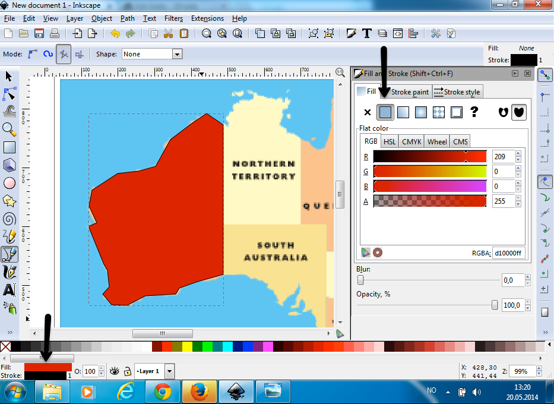
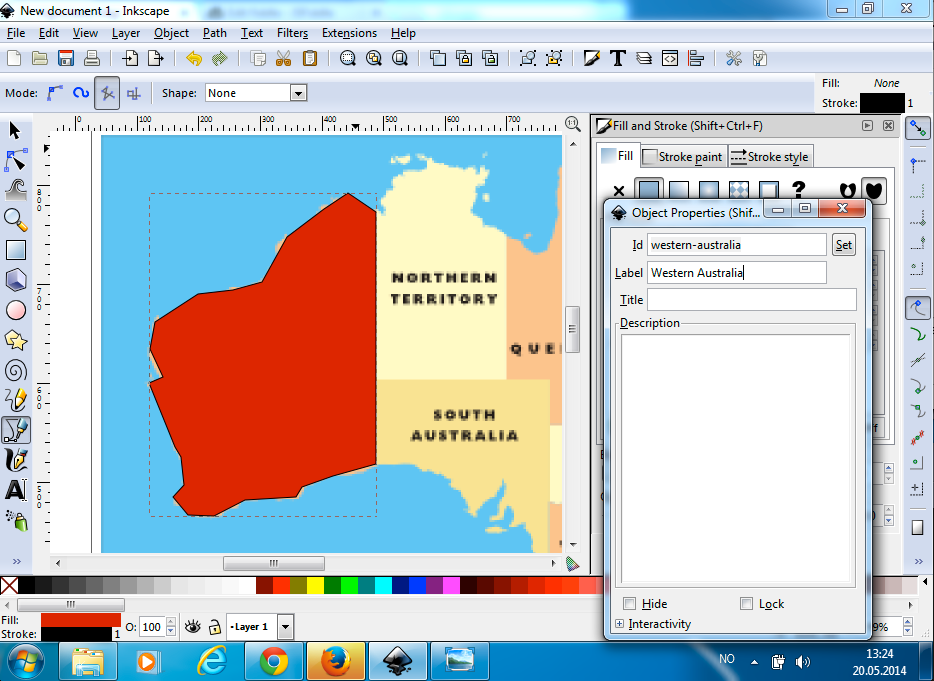
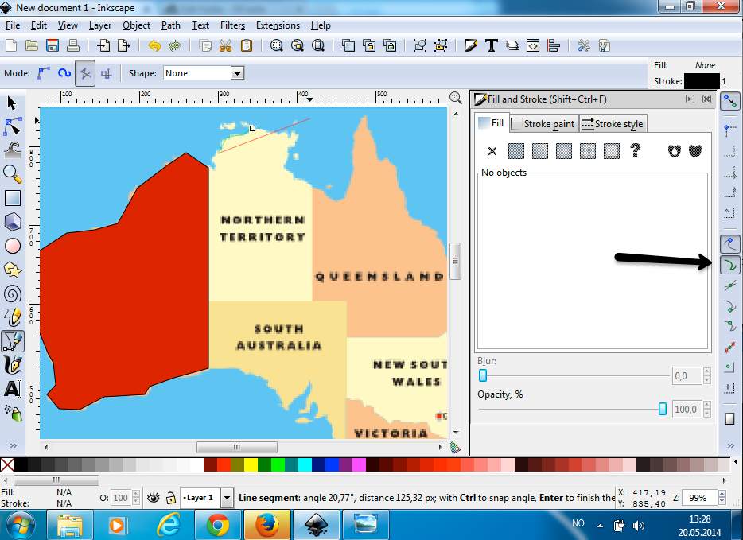
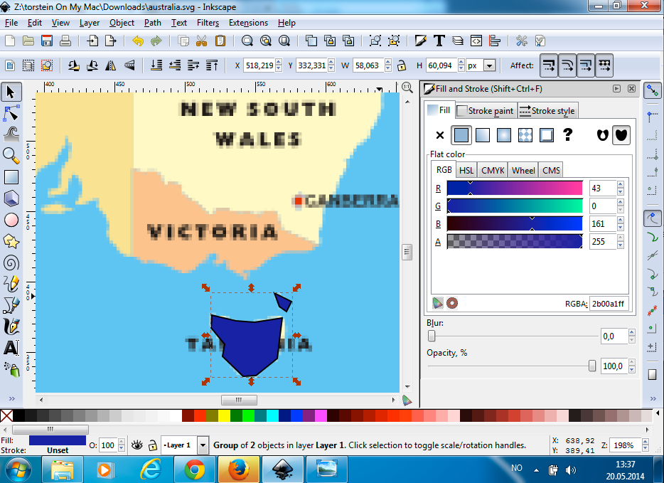
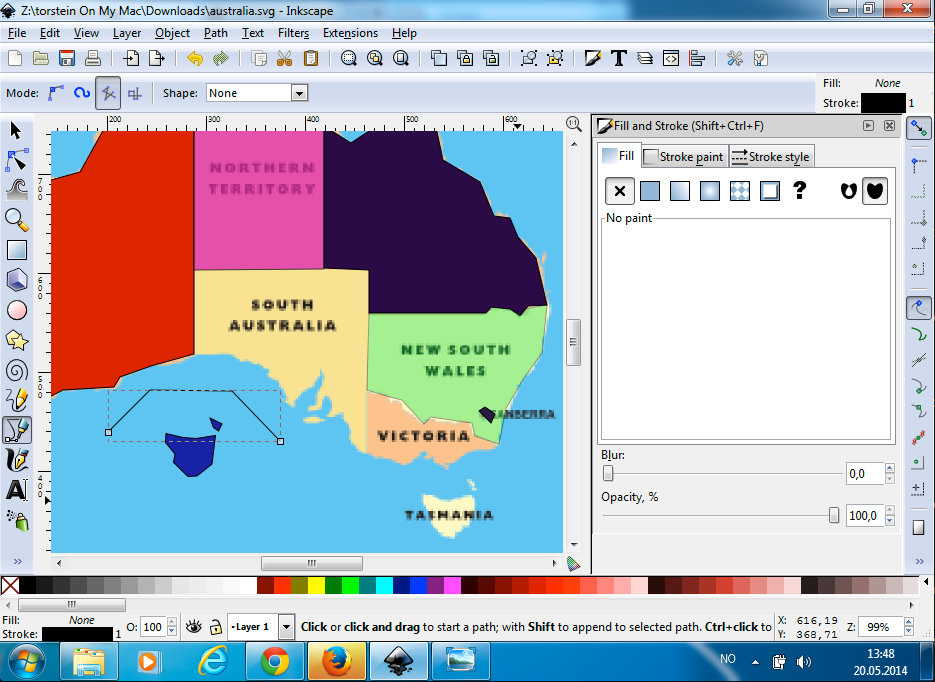
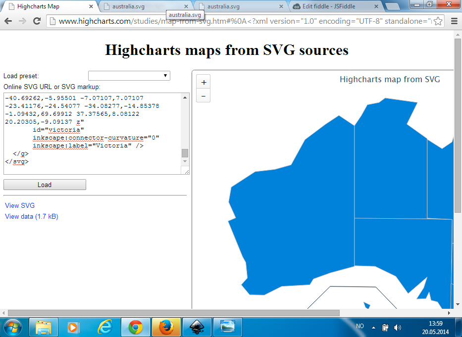
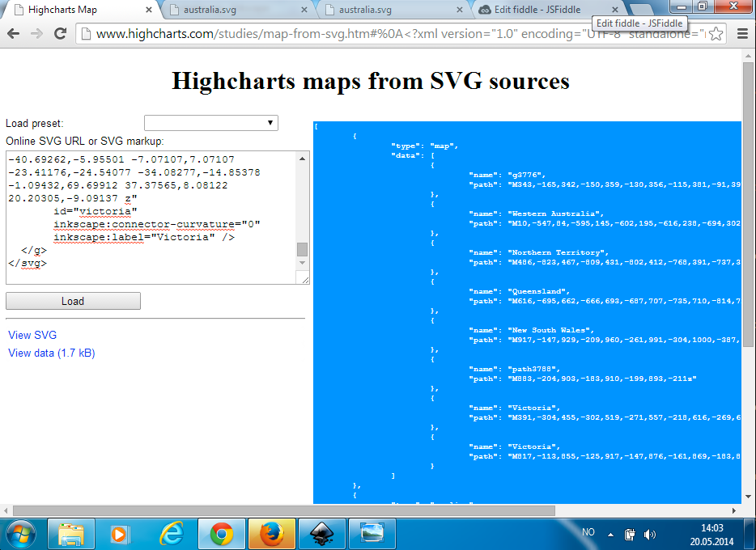

Creating custom maps
===

Highcharts Maps can be used for more than geographic data, and more than the featured maps provided in the demos. This article goes through the process of drawing your own map in Inkscape, and using our online map converter tool to construct an interactive map with data values. We use a map of Australia for demo purposes. (Do not use that in production, we have a better one in our mapdata collection).

1. The first step is to install [Inkscape](https://www.inkscape.org/en/) on your system. This is the only tool you need to install, and it's free. Open up Inkscape, it opens a new document by default.

2. We will use a PNG image in the background and draw actual SVG shapes on top of it. Open the PNG image in Inkscape. Inkscape ask if you want to link or embed the image, choose either of the two.

3. In the left toolbar, select the tool called "Draw bezier curves and straight lines (Shift + F6)".

4. Start drawing around a territory by clicking repeatedly around the perimeter. Nodes can be moved and added if you do mistakes. To start over again with a shape, select it using the "Select and transform objects (F1)" tool, and hit Delete. In the image below we have drawn the shape for Western Australia.



5. The Highcharts Maps converter tool expects fills for areas in order to distinguish it from separators and other lines. In the lower left corner of Inkscape, it says _Fill: None_. Click the text None to bring up the Fill and Stroke dialog. Next to the cross depicting no fill, select the solid fill button. Pick a color.



6. Next, we want to give the territory a name that Highcharts Maps can use for labels and identification. In the Object menu, select _Object Properties (Shift + Ctrl + O)_. Set an _id_ and a _label_. The label is used by Highcharts Maps. Remember to click the _Set_ button, otherwise Inkscape won't apply the information.



7. For the second territory we want to do exactly the same, but there is also another thing to consider. We want the border between the two shapes to align, so that when we zoom in we don't see borders lying close but not on top of each other. We ensure this by selecting the _Snap to path_ button in the right toolbar. Now when we're drawing the second shape, we will get a small cross and a label saying _Handle to path_ when we're getting close to the first shape.



8. Continue like this for the other simple shapes. The next items, #10-#12, will be about special cases; islands, enclaves and separator lines. If you don't have those, jump to #13.

9. **Islands**. Start by drawing one of the islands or associated mainland like any other shape. Give it a fill. Then draw the island and give it a fill. Now select both (or all) shapes by using the Select tool and holding down the Shift key while clicking. In the Object menu, select _Group (Ctrl + G)_. Now you can give the new group an id and a label like in #7.



10. **Enclaves** are territories within another territory. Start by drawing the outer territory like any other shape. Give it a fill and label. Now in the fill and stroke dialog, set the opacity to 50% so that you can see the underlying enclave. Now you are able to draw the enclave on top.

11. **Separator lines** are typically used when an offshore territory is drawn close to the mainland, and the distance is not to scale. In our sample we will move Tasmania to the west and draw a separator. Use the Bezier tool again, and draw the separator where you want it. Double click to close it. That's it. As long as you don't add a fill, the map parser will treat it as a line object.



12. After you're finished drawing, save the file. Inkscape saves as SVG by default. Open the file in a text editor so that you see the SVG/XML markup. Select all and copy. 

13. Using a modern browser (tested with Chrome), go to [highcharts.github.io/map-from-svg](https://highcharts.github.io/map-from-svg). In the textarea labeled "Online SVG URL or SVG markup", paste your SVG markup. Hit the Load button. Now an interactive map should display on the right.



14. The actual map shape data is available under the "View data" link. Click it and copy the whole contents of the text area to the right. This is a JSON object containing the template for the entire [series](https://api.highcharts.com/highmaps/series) options of a new map chart, combining real area data and separator lines.



15. Go to this [link](https://jsfiddle.net/gh/get/library/pure/highcharts/highcharts/tree/master/samples/maps/general/boilerplate/), where you can find an empty boilerplate for Highcharts Maps. Add a series configuration object and paste your data. It should now look like this [demo](https://jsfiddle.net/gh/get/library/pure/highcharts/highcharts/tree/master/samples/maps/series/data-path/).

```js
// Initiate the chart
Highcharts.mapChart('container', {
    series: /* paste your content here */
});
```

16. Now all you have to do is add values to the points to make a useful chart. Alternatively, use the paths in the [mapData](https://api.highcharts.com/highmaps/series<map>.mapData) option and add data separately.

Good luck, and don't hesitate to contact us via our [Support Page](https://www.highcharts.com/blog/support/) if you have any problems or corrections to this article.
