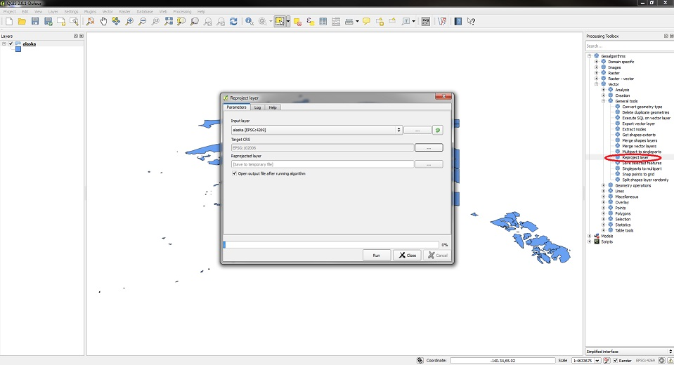

Custom GeoJSON maps
===================

This article contains information on creating maps from data in common mapping formats, as well as modifying the [Highmaps Map Collection](https://code.highcharts.com/mapdata "Highmaps Map Collection"). For information on drawing your own maps and creating maps from SVG, see [this article](https://highcharts.com/docs/maps/custom-maps "Custom maps").

We see that many users have map data in ESRI Shapefile format or other common mapping formats. These can easily be converted for use with Highmaps using an editor with GeoJSON exporting capabilities, as Highmaps supports the GeoJSON format natively. Most full-featured GIS editors will be able to perform this conversion. [QGIS](https://qgis.org "QGIS") is a free alternative that supports both Shapefile, KML, and a number of other formats. See [this demo](https://highcharts.com/maps/demo/geojson-multiple-types/maps/demo/geojson "GeoJSON demo") for an example of how to load polygonal data from a GeoJSON file, and [this demo](https://highcharts.com/maps/demo/geojson-multiple-types "GeoJSON multiple types demo") for a more complex example with line and point data.

The Highmaps map collection is supplied in both SVG and GeoJSON formats, and can be edited using any compatible editor. Simple changes can be made using a text editor. [InkScape](https://inkscape.org "InkScape") is a free visual editor for SVG files. Please note that different coordinate systems are used in the SVG and GeoJSON files, mainly for optimization reasons. The map collection is also supplied as executable Javascript files. These Javascript files are identical to the GeoJSON files, except for a small amount of wrapping code.

Creating maps for Highmaps
--------------------------

We will now go through the process of importing a Shapefile in QGIS and converting it for use with Highmaps. The process is the same when editing the GeoJSON files from our map collection. Note that there are many ways of accomplishing this with QGIS, and that details might vary depending on program version and platform. If you have issues using QGIS, check out their extensive [documentation](https://qgis.org/en/docs/index.html "QGIS Documentation").

1. Once QGIS is installed, the first step is to import your data. To do this, select the "Add Vector Layer" option from the Layer menu. For demonstration purposes, we will use a dataset with USA Zip Code Tabulation Areas available from the [US Census Bureau](http://www.census.gov/cgi-bin/geo/shapefiles2012/main "Zip Code Tabulation Areas"). Our goal is to create a map of the Alaskan Zip codes for use with Highmaps.

2. To extract Alaska from the dataset, choose the box-selection tool in the toolbar, and draw a rectangle around the area you want to select. Then, click "Save Selection as Vector File" in the Layer menu, and save the selected area to a new file.

 

 3. Now, start a new project and import the file you saved, following the same procedure as in step 1. The result should look something like this:

 

4. While this looks okay, we would like to modify the data before exporting it. To get access to the more advanced features of QGIS, open the Processing Toolbox (View->Panels->Toolbox).

 

5. We want to reproject our data to a projection more suitable for Alaska. To do this, open the "Reproject layer" tool in the Toolbox, found under Geoalgorithms->Vector->General tools. As target CRS (Coordinate Reference System), select "NAD27 / Alaska zone 2", EPSG code 26732. Save the result to a temporary file, and make sure to tick the "Open output file after running algorithm" box. After running the tool, you should get a new layer, somewhere out of view. To zoom in on the new layer, right click it in the table of contents, and select "Zoom to Layer Extent". If the process failed somehow, you might need to tweak your projection settings. Refer to the [QGIS documentation](https://docs.qgis.org/3.4/en/docs/user_manual/working_with_projections/working_with_projections.html "Working with projections") for details. 

 

6. Now, we would like to simplify the geometry. The less detail we include in our map, the faster Highmaps will work, and the faster your page will load. QGIS has several tools for this, but the simplest can be found in the Vector menu, under Geometry Tools. Set a tolerance of around 1000, and select a new file to save the result to. Also tick the "Add result to canvas" box. Once the process has finished, you should have a new layer with the simplified geometry.

7. Before exporting, we might want to inspect and modify the properties of our map. To do this, right click the layer in the table of contents and select "Open Attribute Table". These attributes will be included in the GeoJSON when we export our map. Highmaps was designed to be used with user defined maps, and is very flexible in the way that it handles map data. There are therefore no special requirements for metadata in the maps. 

8. When you are satisfied with your map, you need to export it to GeoJSON format in order to use it with Highmaps. To export your map, right click the layer you want to export in the table of contents, and select "Save As". Make sure to select to save in GeoJSON format. The resulting file can be used directly with Highmaps. You will notice that QGIS by default includes a large amount of decimals in the GeoJSON coordinates. These can be stripped using a Regex or similar, for optimization. Try using [this jsFiddle tool](https://jsfiddle.net/highcharts/92oymdb7/ "jsFiddle tool") on the resulting file contents.

9. To quickly test your map, paste your GeoJSON into [this boilerplate jsFiddle](https://jsfiddle.net/Johnbosco/5zmh7k6d/ "GeoJSON maps boilerplate"). The result should look something like this:

You now have your map ready for use with Highmaps.
