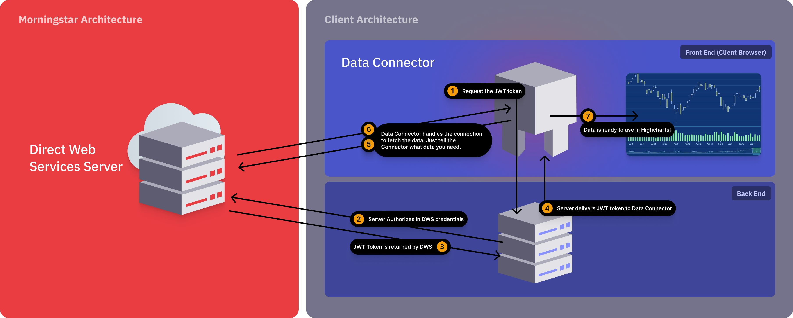

# Morningstar Connectors

With the **Highcharts Connectors** for the **Morningstar Direct Web Services**
you can access finance-related information to different kinds of financial
assets. This requires a Highcharts license and a Morningstar subscription.

## Versions

There are two versions of the scripts, and the difference between them is the
Morningstar API they use. The version with the `dws` suffix uses the newer API,
which provides access to the **Investment Details API** and the **Time Series
API**, with more to come in the future.

## Requirements

You will need credentials to access the services.

- Morningstar credentials (this can be either):
  - Access token from your server
  - Username and password

- Morningstar standalone for Highcharts (this can be either):
  - `@highcharts/connectors-morningstar/connectors-morningstar.js`
  - `@highcharts/connectors-morningstar/connectors-morningstar-dws.js`

- Morningstar Connectors for Dashboards (this can be either):
  - `@highcharts/connectors-morningstar`
  - `@highcharts/connectors-morningstar/dws`

- Package bundler like Webpack.

## Quick Start

The integration of the Morningstar Connectors differs between Highcharts core
products and Highcharts Dashboards.

### Highcharts Quick Start

You can connect Highcharts core products with Morningstar by using
`connectors-morningstar.js` or `connectors-morningstar-dws.js` in the
`connectors-morningstar` bundle. You have to manually create the connector and
assign the resulting table to your series options.

### Highcharts Dashboards Quick Start

For Highcharts Dashboards you just need to load the `connectors-morningstar` or
`connectors-morningstar/dws` bundle, which will register all connectors to the
Dashboards registry. All Morningstar Connectors are then available in the data
pool as other connector types.

### Available Connectors

- Direct Web Services:
  - [DWS Investments Details](https://www.highcharts.com/docs/morningstar/dws/investments-details-connector)
  - [DWS Time Series](https://www.highcharts.com/docs/morningstar/dws/time-series-connector)

- Enterprise Components:
  - [Goal Analysis](https://www.highcharts.com/docs/morningstar/goal-analysis)
  - [Risk Score](https://www.highcharts.com/docs/morningstar/risk-score)
  - [TimeSeries](https://www.highcharts.com/docs/morningstar/time-series/time-series)
  - [X-Ray](https://www.highcharts.com/docs/morningstar/x-ray)
  - [Screener](https://www.highcharts.com/docs/morningstar/screeners/screener)
  - [Security Details](https://www.highcharts.com/docs/morningstar/security-details)
  - [Security Compare](https://www.highcharts.com/docs/morningstar/security-compare)
  - [Performance](https://www.highcharts.com/docs/morningstar/performance)
  - [Hypo Performance](https://www.highcharts.com/docs/morningstar/hypo-performance)

### Morningstar Regions

By default the region of the Morningstar API defaults to the nearest region of
the Morningstar Direct Web Services based on the browser localization settings.
If you would like to change the region that is used for data fetching from the
API, you can define the `url` by setting the `api.url` property to Morningstar
compatible URL.

Example:

```js
  const connector = new HighchartsConnectors.Morningstar.SecurityDetailsConnector({
      api: {
          url: 'https://www.us-api.morningstar.com/',
          access: {
              token: 'your_access_token'
          }
      },
      converters: ['PortfolioHoldings'],
      security: {
          id: 'F0GBR052QA',
          idType: 'MSID'
      },
  });
```

## Architecture

This is a visualization of the Highcharts Morningstar Data Connector:


## Using pre-fetched JSON with `api.json` option

You can bypass API authentication and network requests by passing a json
payload through `api.json` option.

When `api.json` option is set, it has higher priority than `postman` or online
API settings.

```js
const connector = new HighchartsConnectors.Morningstar.SecurityDetailsConnector({
    api: {
        json: [{
            Id: 'SECURITY_ID',
            Isin: 'SECURITY_ISIN',
            Currency: { Id: 'USD' },
            TrailingPerformance: [{
                ReturnType: 'Nav',
                Type: 'DayEnd',
                Return: [{
                    Date: '2026-01-01',
                    TimePeriod: '1M',
                    Value: 1.2
                }]
            }]
        }]
    },
    security: {
        id: 'F0GBR050DD',
        idType: 'MSID'
    },
    converters: ['TrailingPerformance']
});
```

```js
const dwsConnector = new HighchartsConnectors.MorningstarDWS.InvestmentsConnector({
    api: {
        json: {
            AssetAllocationBreakdown: {
                assetAllocationBreakdown: {
                    assetAllocCashPercLong: 4.49556,
                    assetAllocEquityPercLong: 95.50442,
                    canAssetAllocCanadianEquityPercLong: 2.01286,
                    underlyingInstrumentStockPercent: 95.50445
                },
                identifiers: {
                    performanceId: '0P00000FIA'
                },
                metadata: {}
            },
            CountryAndRegionExposure: {
                countryAndRegionalExposureBreakdown: {
                    equityRegionAmericasPercLongRescaled: 55.728,
                    equityRegionNorthAmericaPercLongRescaled: 55.292,
                    equityCountryUnitedStatesPercLongRescaled: 53.18442
                },
                identifiers: {
                    performanceId: '0P00000FIA'
                },
                metadata: {}
            }
        }
    },
    security: {
        id: '0P00000FIA'
    },
    converters: {
        AssetAllocationBreakdown: {},
        CountryAndRegionExposure: {}
    }
});
```
