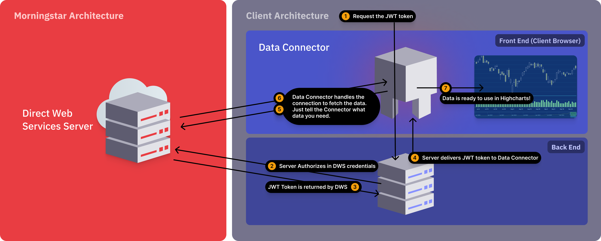

# Morningstar Connectors

With the Highcharts Connectors for the Morningstar Direct Web Services you can
access finance-related information to different kinds of financial assets. This
requires a Highcharts license and a Morningstar subscription.


## Requirements

* Morningstar credentials: You will need credentials to access the services.
  This can be either:
    - Access token from your server
    - Username and password

* Morningstar standalone for Highcharts:
  `@highcharts/connectors-morningstar/connectors-morningstar.js`

* Morningstar connectors for Dashboards:
  `@highcharts/connectors-morningstar`

* Package bundler like Webpack.


## Quick Start

The integration of the Morningstar connectors differs between Highcharts core
products and Highcharts Dashboards.


### Highcharts Quick Start

You can connect Highcharts core products with Morningstar by using
`connectors-morningstar.js` in the `connectors-morningstar` bundle. You have to manually create the connector and
assign the resulting table to your series options.


### Highcharts Dashboards Quick Start

For Highcharts Dashboards you just need to load the `connectors-morningstar`
bundle, which will register all connectors to the Dashboards registry. All
Morningstar connectors are then available in the data pool as other connector
types.


### Available Connectors

* [Goal Analysis](https://www.highcharts.com/docs/morningstar/goal-analysis)
* [RNANews](https://www.highcharts.com/docs/morningstar/regulatory-news-announcements)
* [Risk Score](https://www.highcharts.com/docs/morningstar/risk-score)
* [TimeSeries](https://www.highcharts.com/docs/morningstar/time-series/time-series)
* [X-Ray](https://www.highcharts.com/docs/morningstar/x-ray)
* [Screener](https://www.highcharts.com/docs/morningstar/screeners/screener)
* [Security Details](https://www.highcharts.com/docs/morningstar/security-details)
* [Security Compare](https://www.highcharts.com/docs/morningstar/security-compare)
* [Performance](https://www.highcharts.com/docs/morningstar/performance)
* [Hypo Performance](https://www.highcharts.com/docs/morningstar/hypo-performance)

### Morningstar Regions

By default the region of the Morningstar API defaults to the nearest region of
the Morningstar Direct Web Services based on the browser localization settings.
If you would like to change the region that is used for data fetching from the API,
you can define the `url` by setting the `api.url` property to Morningstar
compatible URL.

Example:

```js
  const connector = new HighchartsConnectors.Morningstar.SecurityDetailsConnector({
      api: {
          url: 'https://www.us-api.morningstar.com/',
          access: {
              token: 'your_access_token'
          }
      },
      converters: ['PortfolioHoldings'],
      security: {
          id: 'F0GBR052QA',
          idType: 'MSID'
      },
  });
```

## Architecture
This is a visualization of the Highcharts Morningstar Data Connector:

