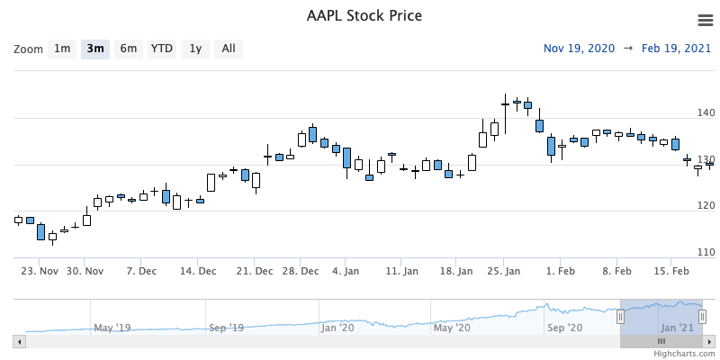

Candlestick chart
================

A candlestick chart is typically used to present the open, high, low and close price over a period of time. A candlestick chart is composed of a body and an upper and a lower wick. The body represents the opening and closing price. If the opening price is higher than the closing price the body is filled. If the closing price is higher than the opening price the body is unfilled. The upper wick represent the highest price during a time period and the lower wick represents the lowest price during a time period.



### ADJUSTING CANDLES COLOR

To highlight candlestick price movement, colors of the candlestick can be easily altered. Any combination of opposing colors can be applied to this type of chart.

Example of changing candlestick colors:
```js
plotOptions: {
    candlestick: {
        color: 'pink'
        lineColor: 'red',
        upColor: 'lightgreen',
        upLineColor: 'green',
    }
}
```

Properties given for candlestick colors are:
- [color](https://api.highcharts.com/highstock/plotOptions.candlestick.color) - Candle body color when going down (closing value is lower than the opening value)
- [lineColor](https://api.highcharts.com/highstock/plotOptions.candlestick.lineColor) - Color of the wick when going down (closing value is lower than the opening value)
- [upColor](https://api.highcharts.com/highstock/plotOptions.candlestick.upColor) - Candle body color when going up (closing value is higher than the opening value), by default it is transparent
- [upLineColor](https://api.highcharts.com/highstock/plotOptions.candlestick.upLineColor) - Color of the wick when going up (closing value is higher than the opening value)

<iframe src="https://www.highcharts.com/samples/embed/stock/plotoptions/candlestick-linecolor" width="100%" height="400" allow="fullscreen"></iframe>

For more information on the candlestick chart, see the [API reference](https://api.highcharts.com/highstock/plotOptions.candlestick).
