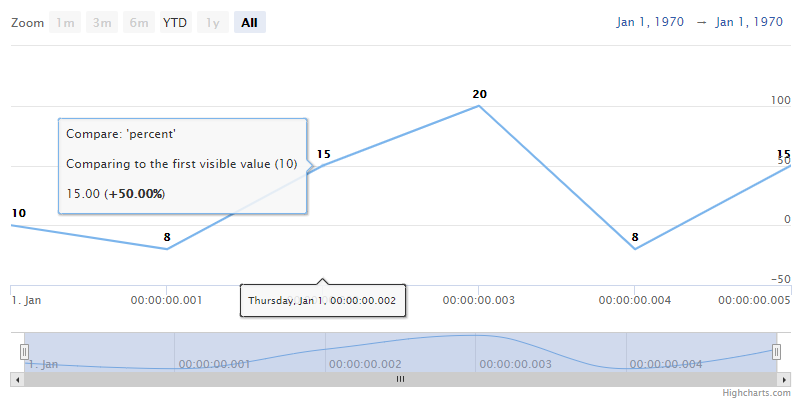

Compare
================

The compare tool is used to compare each points' value to the first value in a visible range (or to the first point before the range, more info: [compareStart](https://api.highcharts.com/highstock/plotOptions.series.compareStart)).

The `compare` can be enabled in the chart's options, see the [API reference](https://api.highcharts.com/highstock/plotOptions.series.compare). Available options for the `series.compare` property are:
*   `percent` - percentage difference (image above), e.g. if the first visible value is 10 and the current value is 8, then the compare equals to 80% (or -20% when the [compareBase](https://api.highcharts.com/highstock/plotOptions.series.compareBase) is set to 0).
*   `value` - difference between the values, e.g. if the first visible value is 10 and the current value is 8, then the compare equals to -2.

The `compare` can be also enabled/disabled on a specific series by the [series.setCompare()](https://api.highcharts.com/class-reference/Highcharts.Series#setCompare) method or on all the series belonging to a specific y-axis by the [yAxis.setCompare()](https://api.highcharts.com/class-reference/Highcharts.Axis#setCompare) method.