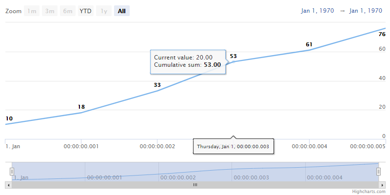

Cumulative Sum
================

The Cumulative Sum tool sums (cumulates) all the previous values with the current value in a visible range.

For the following data: `[10, 8, 15, 20, 8, 15]` the Cumulative Sum returns `[10, 18, 33, 53, 61, 76]` (see the graph below):

The `cumulative` can be enabled in the chart's options using the [series.cumulative](https://api.highcharts.com/highstock/plotOptions.series.cumulative) property or enabled/disabled by the [series.setCumulative()](https://api.highcharts.com/class-reference/Highcharts.Series#setCumulative) method or on all the series belonging to a specific y-axis by the [yAxis.setCumulative()](https://api.highcharts.com/class-reference/Highcharts.Axis#setCumulative) method.

With `dataGrouping` enabled, default grouping [approximation](https://api.highcharts.com/highstock/plotOptions.series.dataGrouping.approximation) is set to _sum_.