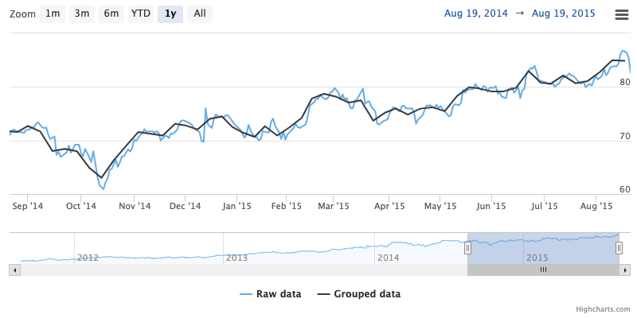

Data grouping
===========

Data grouping replaces a sequence of data points in a series with one grouped point. The values of each grouped point is calculated from the original values of every point used. The [groupPixelWidth](https://api.highcharts.com/highstock/plotOptions.series.dataGrouping.groupPixelWidth) option defines how large the groups should be.

By default, the grouping [approximation](https://api.highcharts.com/highstock/plotOptions.series.dataGrouping.approximation) depends on the type of series:

*   Line type series use an _average_ approximation.
*   Column type series compute the _sum_.
*   Range type series compute the union's _range_.
*   OHLC type series compute the union's open, high, low and close (OHLC) values.

Grouping is activated when there are many data points in the chart. As well as increasing performance it makes it easier to spot trends in a chart.

Data grouping is a Highcharts Stock feature and is enabled by default. To see dataGrouping options see the [API reference](https://api.highcharts.com/highstock/plotOptions.series.dataGrouping).

### The x-value for a grouped point

 <iframe width="320" height="800" src="https://www.highcharts.com/samples/embed/stock/plotoptions/series-datagrouping-first-anchor" allow="fullscreen"></iframe>

Grouped points can be positioned inside the group using [anchor](https://api.highcharts.com/highstock/plotOptions.series.dataGrouping.anchor) property which might take values: 

* `start` places the point always at the beginning of the group  (e.g. range 00:00:00 - 23:59:59 -> 00:00:00)
* `middle` places the point always in the middle of the group (e.g. range 00:00:00 - 23:59:59 -> 12:00:00)
* `end` places the point always at the end of the group (e.g. range 00:00:00 - 23:59:59 -> 23:59:59)

Additionally [firstAnchor](https://api.highcharts.com/highstock/plotOptions.series.dataGrouping.firstAnchor) and [lastAnchor](https://api.highcharts.com/highstock/plotOptions.series.dataGrouping.lastAnchor) properties can be used to position the first and the last point in the data set (not in the current zoom). In addition to the the values described above, they might have values:
* `firstPoint` the first point in the group  (e.g. points at 00:13, 00:35, 00:59 -> 00:13)
* `lastPoint` the last point in the group (e.g. points at 00:13, 00:35, 00:59 -> 00:59)