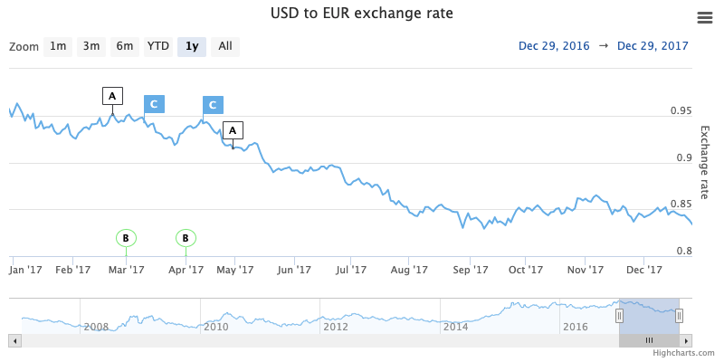

Flag series (Highstock only)
================

A flag series consists of flags marking events or points of interests. Used alone flag series will make no sense. Flags can be placed on either the series of the chart or on the axis.

Flag series belong to Highstock, but they can also be applied to a regular Highcharts chart created with the Highcharts.Chart() constructor as long as the highstock.js file is loaded in the page. See the [FAQ item](https://highcharts.com/docs/frequently-asked-questions#highstock-features-in-highcharts) on the matter. 



Every flag consists of x, title and text. The attribute "x" must be set to the point where the flag should appear. The attribute "title" is the text which is displayed inside the flag on the chart. The attribute "text" contains the text which will appear when the mouse hover above the flag.

To create a flag series, add the following configuration in the series option:

```js
{
    type : 'flags',
    data : [{
        x : 0,      // Point where the flag appears
        title : '', // Title of flag displayed on the chart 
        text : ''   // Text displayed when the flag are highlighted.
    }],
    onSeries : '',  // Id of which series it should be placed on. If not defined 
                    // the flag series will be put on the X axis
    shape : 'flag'  // Defines the shape of the flags.
}
```

For an overview of the flag series options see the [API reference](https://api.highcharts.com/highstock/plotOptions.flags).

Flagseries examples
-------------------

*   [Flags marking events](https://highcharts.com/stock/demo/flags-general)
*   [Flags placement](https://highcharts.com/stock/demo/flags-placement)
*   [Flags shapes and colors](https://highcharts.com/stock/demo/flags-shapes)
